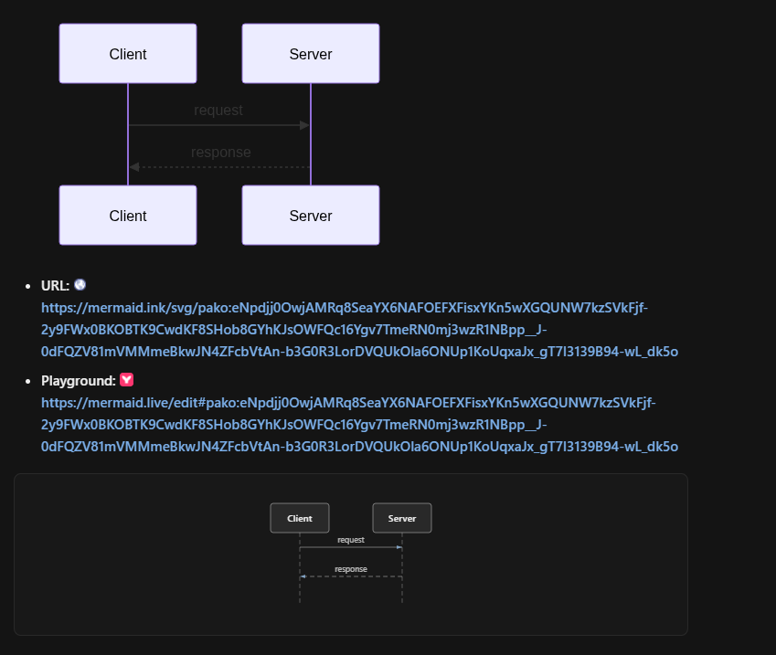

# UML-MCP: Diagram Generation via MCP

[](https://github.com/antoinebou12/uml-mcp/actions/workflows/test.yml)
[](https://github.com/antoinebou12/uml-mcp/actions/workflows/build.yml)
[](https://github.com/antoinebou12/uml-mcp/actions/workflows/docs.yml)
[](https://github.com/antoinebou12/uml-mcp/actions/workflows/deploy.yml)
[](https://github.com/antoinebou12/uml-mcp/releases)
[](https://github.com/antoinebou12/uml-mcp/stargazers)
[](https://github.com/antoinebou12/uml-mcp/network/members)
[](https://github.com/antoinebou12/uml-mcp/issues)
[](https://opensource.org/licenses/MIT)
[](https://www.python.org/downloads/)
[](https://github.com/astral-sh/ruff)
[](https://github.com/astral-sh/uv)
[](https://modelcontextprotocol.io/)
[](https://uml-mcp.vercel.app/mcp)
[](https://mcpvitals.com/status/6cfb821be2)
[](https://mseep.ai/app/antoinebou12-uml-mcp)
[](https://getlulu.dev/mcps/uml-mcp)
[](https://smithery.ai/servers/antoinebou12/uml)

Generate UML and other diagrams through the [Model Context Protocol](https://modelcontextprotocol.io/) — Cursor, Claude, Copilot, ChatGPT, and any MCP client.

| | |
| --- | --- |
| **Live MCP** | [https://uml-mcp.vercel.app/mcp](https://uml-mcp.vercel.app/mcp) |
| **Docs** | [antoinebou12.github.io/uml-mcp](https://antoinebou12.github.io/uml-mcp/) |
| **Catalog** | ~37 Kroki-backed types · 5 MCP tools · URL + playground + chat PNG |

<p align="center">
  
</p>

<p align="center"><sub>Chat reply shape: diagram preview · <b>URL</b> · <b>Playground</b> (mermaid.live)</sub></p>

## Quick start

**Remote (recommended)** — add to your MCP client:

```json
"uml-mcp": {
  "transport": "http",
  "url": "https://uml-mcp.vercel.app/mcp"
}
```

Use **`/mcp`**, not the site root. Repo default: [`.cursor/mcp.json`](.cursor/mcp.json).

<details>
<summary><strong>Local stdio</strong></summary>

```bash
git clone https://github.com/antoinebou12/uml-mcp.git && cd uml-mcp
uv sync
uv run python server.py
```

Configs: [`config/cursor_config.json`](config/cursor_config.json) · [`config/claude_desktop_config.json`](config/claude_desktop_config.json) · [`config/README.md`](config/README.md)

</details>

<details>
<summary><strong>Claude Code plugin</strong></summary>

```text
/plugin marketplace add https://github.com/antoinebou12/uml-mcp
/plugin install uml-mcp@uml-mcp-plugins
```

[docs/integrations/claude_code.md](docs/integrations/claude_code.md) · Cursor skill: [`.skill/skills/uml-mcp-diagrams/SKILL.md`](.skill/skills/uml-mcp-diagrams/SKILL.md)

</details>

## At a glance

| Topic | What you get |
| --- | --- |
| **Diagrams** | ~37 types via [Kroki](https://kroki.io/) (UML, Mermaid, D2, TikZ, BPMN, C4, GoAT, UMLet, …) |
| **Tools** | `generate_uml` · `generate_uml_image` · `validate_uml` · `list_diagram_types` · `generate_uml_batch` |
| **Chat** | Inline PNG + markdown `` + **Playground** link |
| **Deploy** | Local · Docker · [Vercel](https://vercel.com/) · [Smithery](https://smithery.ai/) |

<details>
<summary><strong>MCP tools</strong></summary>

| Tool | Purpose |
| --- | --- |
| `generate_uml` | Render one diagram; tool text includes image markdown, **URL**, **Playground**. Use `png` for ImageContent. |
| `generate_uml_image` | Inline chat image (default PNG); fetches bytes even under hosted `MCP_URL_ONLY` |
| `validate_uml` | Local checks; `strict` for Mermaid/D2 (rejects semicolon-packed `sequenceDiagram`) |
| `list_diagram_types` | Catalog (like `uml://types`) |
| `generate_uml_batch` | Many diagrams (`MCP_BATCH_MAX_ITEMS`, `MCP_BATCH_CONCURRENCY`) |

Smoke prompts: [`tests/prompts/chatgpt_mcp_smoke_test.md`](tests/prompts/chatgpt_mcp_smoke_test.md)

</details>

<details>
<summary><strong>Resources (<code>uml://</code>)</strong></summary>

| Resource | Description |
| --- | --- |
| `uml://types` | Types, backends, formats |
| `uml://templates` / `uml://examples` | Starters and samples |
| `uml://formats` / `uml://capabilities` | Formats and validation matrix |
| `uml://server-info` / `uml://workflow` | Version/tools and plan-then-generate |

</details>

<details>
<summary><strong>Diagram types</strong></summary>

| Category | Examples |
| --- | --- |
| UML | Class, Sequence, Activity, Use Case, State, Component, Deployment, Object |
| General | Mermaid, D2, Graphviz, ERD, BlockDiag, BPMN, C4 |
| Specialized | TikZ, Excalidraw, GoAT, UMLet, Nomnoml, Pikchr, Structurizr, SVGBob, WaveDrom, WireViz, … |

[docs/diagrams/index.md](docs/diagrams/index.md)

</details>

<details>
<summary><strong>Remote vs local</strong></summary>

| | Remote (Vercel) | Local |
| --- | --- | --- |
| Transport | HTTP MCP | stdio or HTTP |
| File writes | No | Optional |
| Chat images | PNG tools fetch bytes under URL-only | Same + optional disk |
| Env | Server-side | Your `.env` |

</details>

<details>
<summary><strong>Deployment</strong></summary>

**Vercel** — connect the repo; clients use `https://<project>.vercel.app/mcp`.

**Smithery** — paste that `/mcp` URL at [smithery.ai/new](https://smithery.ai/new). Guide: [docs/integrations/vercel_smithery.md](docs/integrations/vercel_smithery.md).

**Docker**

```bash
docker compose up -d
docker build -t uml-mcp . && docker run -p 8000:8000 uml-mcp
docker run -i uml-mcp python server.py --transport stdio
```

[docs/deploy/docker.md](docs/deploy/docker.md)

</details>

<details>
<summary><strong>Configuration (local)</strong></summary>

| Variable | Default |
| --- | --- |
| `KROKI_SERVER` | `https://kroki.io` |
| `PLANTUML_SERVER` | `http://plantuml-server:8080` |
| `MCP_OUTPUT_DIR` | `./output` |
| `MCP_READ_ONLY` | `false` |
| `MCP_URL_ONLY` | see [docs/configuration.md](docs/configuration.md) |
| `MCP_BATCH_MAX_ITEMS` | `20` |
| `MCP_BATCH_CONCURRENCY` | `4` |
| `MCP_RATE_LIMIT_PER_MINUTE` | `0` |

Full list: [docs/configuration.md](docs/configuration.md)

</details>

<details>
<summary><strong>Architecture & layout</strong></summary>

Assistant → `generate_uml` / `generate_uml_image` → Kroki (+ fallbacks) → `url`, `playground`, optional image bytes.

<p align="center">
  
</p>

```text
server.py / app.py     -- MCP + FastAPI (/mcp)
mcp_core/tools/        -- generate_uml, generate_uml_image, validate, batch
tools/kroki/           -- Kroki, PlantUML, Mermaid, D2
```

**AG-UI:** `POST /ag-ui/generate` — [docs/integrations/frontend.md](docs/integrations/frontend.md)

</details>

<details>
<summary><strong>Development</strong></summary>

```bash
uv sync --all-groups
uv run pytest tests/ -v
uv run ruff check . && uv run ruff format --check .
make ci
```

Docs locally: `uv run mkdocs serve` → http://127.0.0.1:8000

</details>

## Links

| | |
| --- | --- |
| Docs | [Site](https://antoinebou12.github.io/uml-mcp/) · [Cursor](docs/integrations/cursor.md) · [Claude Code](docs/integrations/claude_code.md) · [Frontend](docs/integrations/frontend.md) |
| Contribute | [CONTRIBUTING.md](CONTRIBUTING.md) · [CODE_OF_CONDUCT.md](CODE_OF_CONDUCT.md) · [SECURITY.md](SECURITY.md) |
| License | [MIT](LICENSE) |

Maintained by [Antoine Boucher](https://github.com/antoinebou12). Built on [PlantUML](https://plantuml.com/), [Kroki](https://kroki.io/), [Mermaid](https://mermaid.js.org/), and [D2](https://d2lang.com/).
