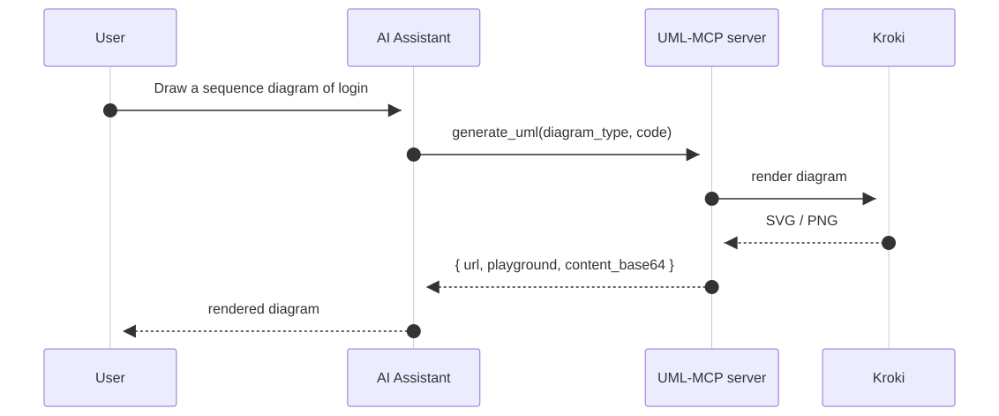

# UML-MCP: Diagram Generation via MCP

[](https://github.com/antoinebou12/uml-mcp/actions/workflows/test.yml)
[](https://github.com/antoinebou12/uml-mcp/actions/workflows/build.yml)
[](https://github.com/antoinebou12/uml-mcp/actions/workflows/docs.yml)
[](https://github.com/antoinebou12/uml-mcp/stargazers)
[](https://opensource.org/licenses/MIT)
[](https://www.python.org/downloads/)
[](https://mseep.ai/app/antoinebou12-uml-mcp)
[](https://mcpvitals.com/status/6cfb821be2)
[](https://getlulu.dev/mcps/uml-mcp)
[](https://smithery.ai/servers/antoinebou12/uml)

Generate UML and other diagrams through the [Model Context Protocol](https://modelcontextprotocol.io/).

### At a glance

| Topic | What you get |
| --- | --- |
| **Diagrams** | **30+ types**: UML (Class, Sequence, Activity, Use Case, State, Component, Deployment, Object), Mermaid, D2, Graphviz, TikZ, ERD, BlockDiag, BPMN, C4, and more via [Kroki](https://kroki.io/) |
| **MCP tools** | `generate_uml`, `validate_uml`, `list_diagram_types`, `generate_uml_batch` |
| **Outputs** | SVG, PNG, PDF, JPEG, base64 (availability varies by diagram type) |
| **Pipeline** | Kroki first, then [PlantUML](https://plantuml.com/) or [Mermaid.ink](https://mermaid.ink/) |
| **Deployment** | Local stdio, local HTTP, Docker, [Vercel](https://vercel.com/), [Smithery](https://smithery.ai/) |

| Source | URL |
| --- | --- |
| Live MCP (HTTP) | [https://uml-mcp.vercel.app/mcp](https://uml-mcp.vercel.app/mcp) |
| Smithery catalog | [Add via Smithery](https://smithery.ai/server/antoinebou12/uml) |
| Lulu MCPs | [getlulu.dev/mcps/uml-mcp](https://getlulu.dev/mcps/uml-mcp) |


## Quick Start

### Choose your mode

- **Remote (recommended):** Fast setup over HTTP MCP with Vercel serverless runtime
- **Local:** stdio process for file output and local debugging

### Remote quick start (Vercel HTTP MCP)

Configuration for the public Vercel deployment:

```json
"uml-mcp": {
  "transport": "http",
  "url": "https://uml-mcp.vercel.app/mcp"
}
```

### Local quick start (stdio MCP)

```bash
git clone https://github.com/antoinebou12/uml-mcp.git && cd uml-mcp
uv sync
uv run python server.py
```

Example client configs:

- `config/cursor_config.json`
- `config/claude_desktop_config.json`
- `config/README.md` for exact config file locations
- **Claude Code:** install the bundled plugin from the repo marketplace (see below) or read [docs/integrations/claude_code.md](docs/integrations/claude_code.md)

### Claude Code plugin

Adds the hosted HTTP MCP server plus a diagram skill (no `settings.json` paste). In Claude Code:

```text
/plugin marketplace add https://github.com/antoinebou12/uml-mcp
/plugin install uml-mcp@uml-mcp-plugins
```

Use a local path instead of the GitHub URL if you already cloned this repo. Custom endpoints and validation: [docs/integrations/claude_code.md](docs/integrations/claude_code.md).

## Remote vs Local

- **Transport:** Remote uses HTTP MCP, local uses stdio by default
- **Runtime:** Remote runs on Vercel, local runs in your Python environment
- **File writes:** Remote is read-only (no `output_dir`), local supports `output_dir`
- **Returned data:** Both return URL + base64; local can also save files
- **Environment variables:** Remote is managed server-side; local reads your env config

MCP clients must call `/mcp`, not the site root.

## Supported Diagram Types

| Category | Examples |
| --- | --- |
| UML (PlantUML) | Class, Sequence, Activity, Use Case, State, Component, Deployment, Object |
| General | Mermaid, D2, Graphviz, ERD, BlockDiag, BPMN, C4 |
| Specialized | TikZ, Excalidraw, Nomnoml, Pikchr, Structurizr, SVGBob, WaveDrom, WireViz, … |

Full list with supported formats: run `python server.py --list-tools` or query `uml://types` and `uml://formats`.

## MCP Tools and Resources

### Tools

| Tool | Purpose |
| --- | --- |
| `generate_uml` | Render a diagram; omit `output_dir` for URL/base64 only |
| `validate_uml` | Structural validation before render; `strict` enables extra Mermaid/D2 checks |
| `list_diagram_types` | Same metadata as `uml://types` when resources are awkward |
| `generate_uml_batch` | Multiple diagrams in one call (cap: `MCP_BATCH_MAX_ITEMS`) |

### Resources (`uml://`)

| Resource | Description |
| --- | --- |
| `uml://types` | Diagram types, backends, supported formats per type |
| `uml://templates` | Starter templates per type; see [BPMN 2.0.2 guide](docs/tutorials/bpmn.md) for element and flow reference (docs) |
| `uml://examples` | Example diagrams per type; [Mermaid](docs/diagrams/mermaid.md) documents named samples (sequence API, Gantt) alongside `uml://examples` (key `mermaid`) |
| `uml://formats` | Output formats per type |
| `uml://capabilities` | Type → backend → formats matrix used for validation |
| `uml://server-info` | Server name, version, tools, prompts, Kroki/PlantUML URLs |
| `uml://workflow` | Recommended plan-then-generate workflow |

## Deployment

### Vercel

This repo includes `vercel.json` for serverless deployment.

1. Connect the repo to [Vercel](https://vercel.com)
2. Use `https://<project>.vercel.app/mcp`
3. Keep `/mcp` in all MCP client URLs

### Smithery

1. Open [smithery.ai/new](https://smithery.ai/new), choose **URL**
2. Enter `https://<project>.vercel.app/mcp`
3. Configure display name, description, and homepage

Detailed guide: [docs/integrations/vercel_smithery.md](docs/integrations/vercel_smithery.md)

### Docker

Default image serves FastAPI on port 8000 with MCP HTTP at `http://127.0.0.1:8000/mcp`.

```bash
# Full local stack (local Kroki + mermaid + blockdiag)
docker compose up -d

# API + MCP only (public Kroki)
docker build -t uml-mcp . && docker run -p 8000:8000 uml-mcp

# stdio MCP subprocess mode
docker run -i uml-mcp python server.py --transport stdio
```

## Configuration (Local runtime)

These variables apply to local/self-hosted runs. Remote Vercel endpoint settings are managed server-side.

| Variable | Description | Default |
| --- | --- | --- |
| `KROKI_SERVER` | Kroki server URL | `https://kroki.io` |
| `PLANTUML_SERVER` | PlantUML server URL | `http://plantuml-server:8080` |
| `MCP_OUTPUT_DIR` | Diagram output directory | `./output` |
| `MCP_READ_ONLY` | Disable file writes | `false` |
| `MCP_MAX_CODE_LENGTH` | Max diagram code length | `500000` |
| `MCP_BATCH_MAX_ITEMS` | Max items per `generate_uml_batch` | `20` |
| `MCP_RATE_LIMIT_PER_MINUTE` | HTTP rate limit per IP for diagram/MCP routes (`0` = off) | `0` |
| `USE_LOCAL_KROKI` | Use local Kroki instance | `false` |
| `USE_LOCAL_PLANTUML` | Use local PlantUML instance | `false` |

Full options: [docs/configuration.md](docs/configuration.md)

## Architecture

Typical flow when a user asks an MCP-enabled assistant for a diagram: the assistant calls `generate_uml`, the server renders via Kroki, then returns URLs and optional base64 to the assistant for the user.

<p align="center">
  
</p>

```text
server.py              -- MCP entry point (stdio/HTTP)
app.py                 -- FastAPI REST API + MCP HTTP at /mcp
api/app.py             -- legacy re-export of root app (Vercel FastAPI preset uses root app.py)
mcp_core/
  core/                -- config, server, CLI, utilities, diagram pipeline
  tools/               -- generate_uml, validate_uml
  prompts/             -- diagram generation prompts
  resources/           -- uml:// resource handlers
tools/kroki/           -- Kroki, PlantUML, Mermaid, D2 clients
```

## Development

```bash
# Install dev dependencies
uv sync --all-groups

# Run tests
uv run pytest tests/ -v

# Lint
uv run ruff check . && uv run ruff format --check .

# Local CI
make ci
```

## Documentation

Built with [MkDocs](https://www.mkdocs.org/) + [Material](https://squidfunk.github.io/mkdocs-material/):

- **Online**: [antoinebou12.github.io/uml-mcp](https://antoinebou12.github.io/uml-mcp/)
- **Local**: `uv run mkdocs serve` then open [http://127.0.0.1:8000](http://127.0.0.1:8000)

## Contributing

- [Contributing guide](CONTRIBUTING.md)
- [Code of conduct](CODE_OF_CONDUCT.md)
- [Security policy](SECURITY.md)

## License

[MIT](LICENSE)

## Acknowledgements

[PlantUML](https://plantuml.com/) | [Kroki](https://kroki.io/) | [Mermaid](https://mermaid.js.org/) | [D2](https://d2lang.com/)
