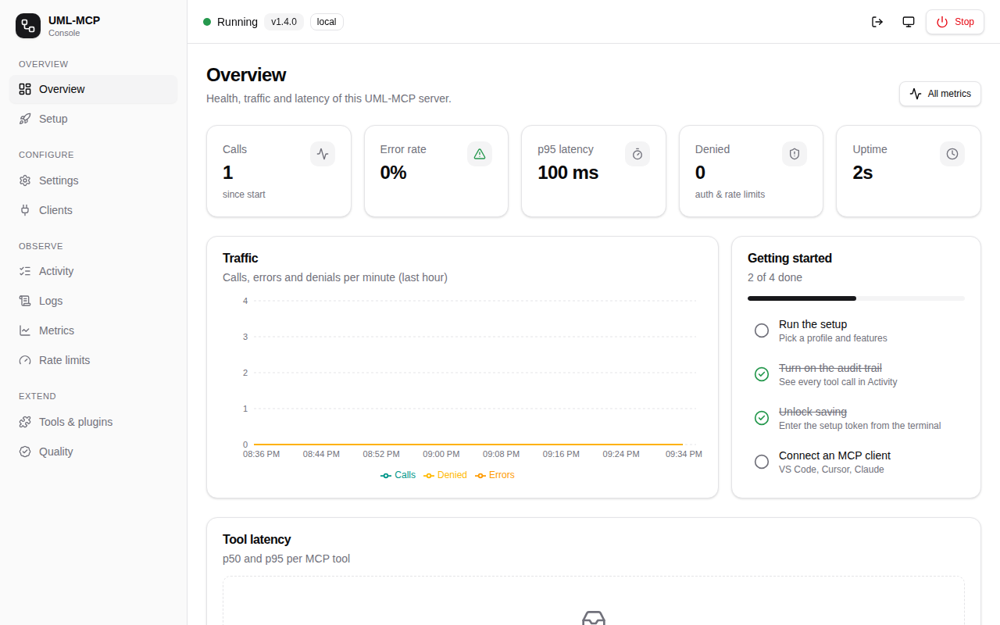
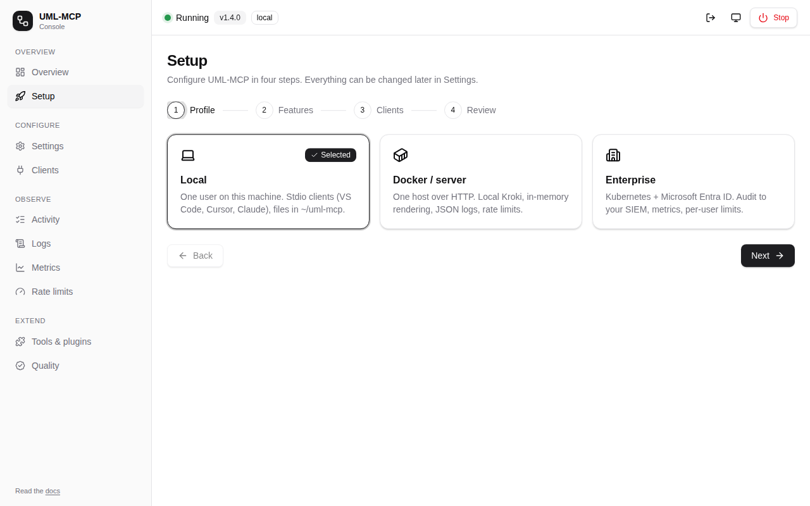
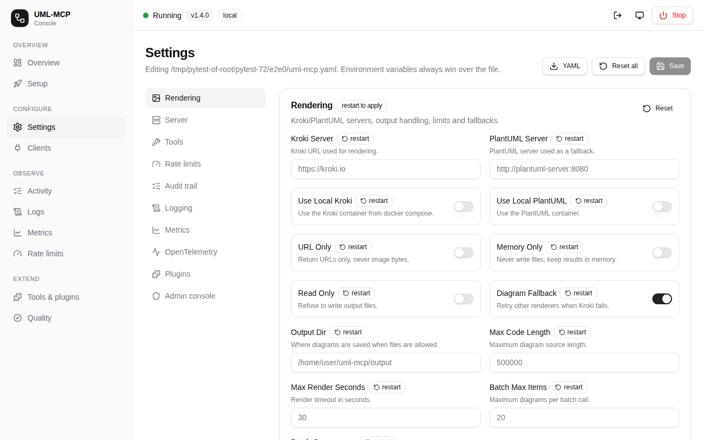
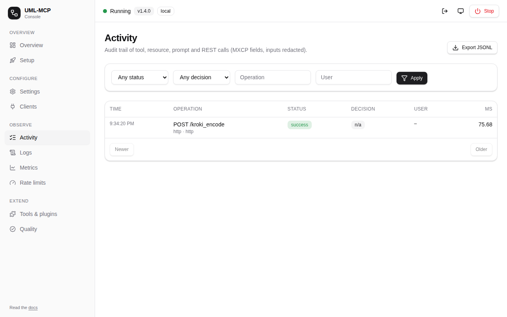
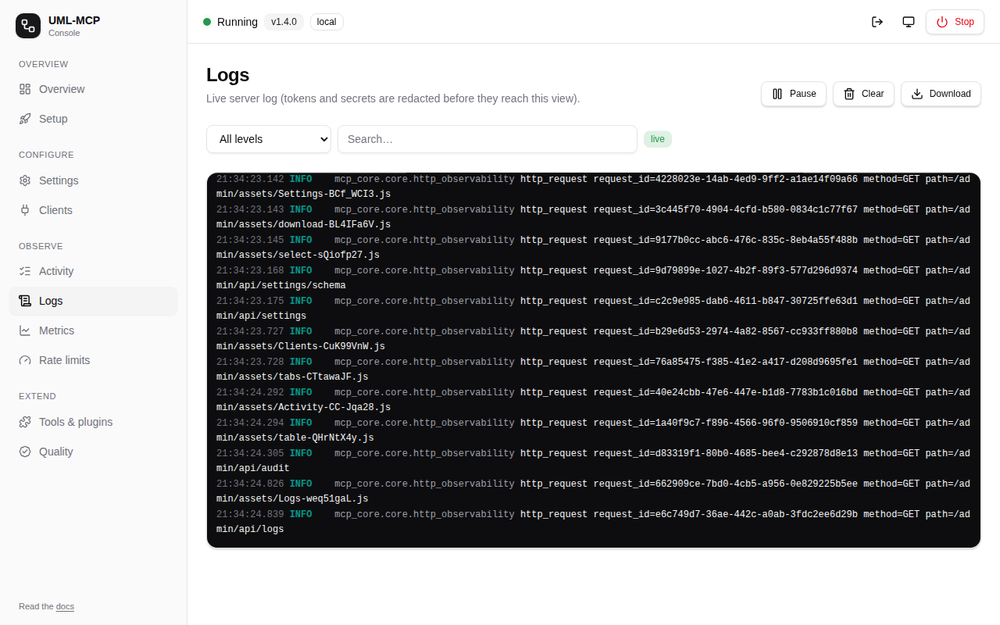
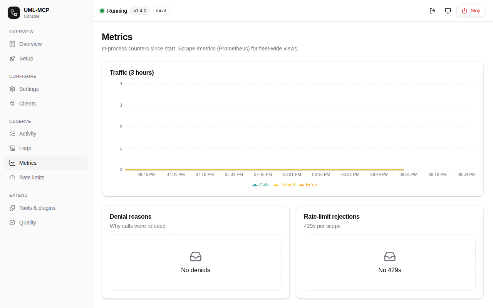
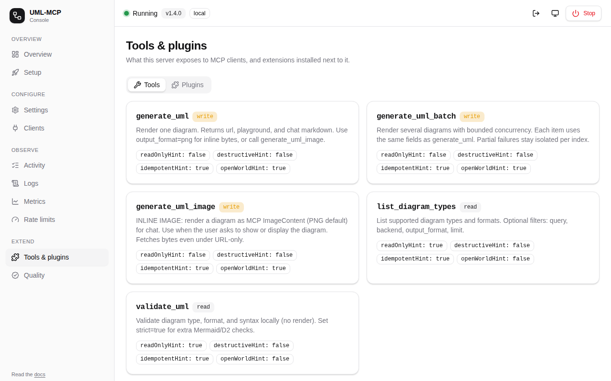
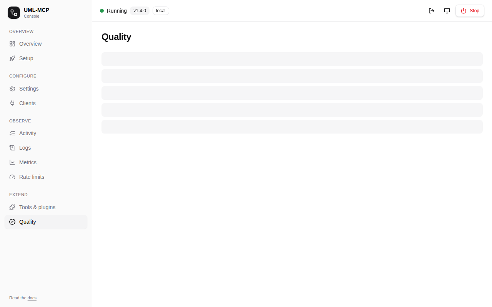
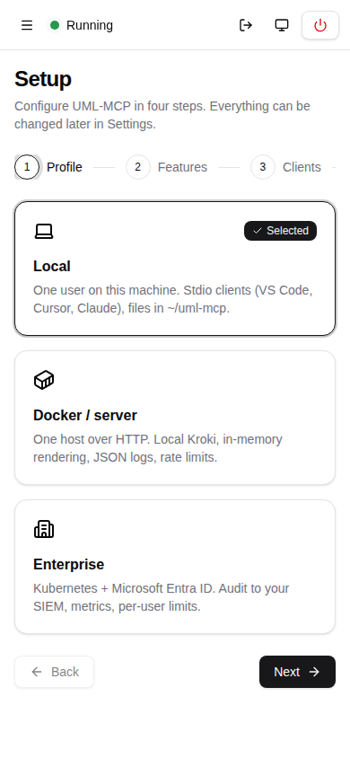
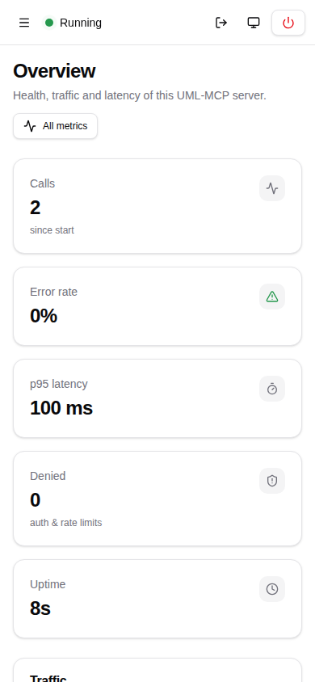

# Admin console

The console is a web UI for installing, configuring and operating UML-MCP. It uses a
shadcn-style design with a side menu (a slide-out menu on phones), light, dark or
system theme, and charts.

```bash
uml-mcp admin                 # local: http://127.0.0.1:8765/admin (opens the browser)
uml-mcp setup --web           # same, starting on the Setup page
```

On a deployed server the console lives at `https://<host>/admin`.



## Access and safety

| Mode | Who can read | Who can change (save, reset, stop, register clients) |
| --- | --- | --- |
| **Local** (enterprise auth off) | Loopback clients whose `Host` is `localhost`/`127.0.0.1` (a DNS-rebinding defence); others get 404 | Also the one-time **setup token**. `uml-mcp admin` prints it, or set `UML_MCP_ADMIN_TOKEN`. Every change also sends an `X-UML-MCP-Admin` header, so other websites can't forge it. |
| **Enterprise** (`MCP_AUTH_MODE` on) | Users with the Entra app role **`MCP.Admin`** | Also opt in with `admin.allow_write: true` (settings) and `admin.allow_stop: true` (Stop). Both are off by default, so the console stays read-only (GitOps). |

How the local mode is set up:

- It is served when auth is off and `admin.allow_local_without_auth: true`. `uml-mcp admin` always serves it.
- The token travels in the URL **fragment**, so it never reaches server logs. The console removes it from the address bar and keeps it for the browser tab only.

Every change is written to the [audit trail](../enterprise/operations.md) (`operation_type: admin`).
Saves are atomic, the file is written with mode `0600`, and the previous file is kept as a
timestamped backup.

## Pages

### Overview

- **KPIs:** calls, error rate, p95 latency, denials, uptime
- **Charts:** calls, errors and denials per minute for the last hour, and p50/p95 latency per tool
- **Getting started checklist**, shown until setup is done

### Setup



1. **Profile:** Local, Docker / server or Enterprise.
2. **Features:** one card per feature with a description, category, and **live** or
   **restart** badge (same catalog as `uml-mcp setup`), plus the Kroki URL.
3. **Clients:** VS Code, Cursor, Claude Desktop, Claude Code (registered on this machine
   in local mode).
4. **Review:** the exact YAML that will be written, then **Save & finish**.

### Settings



The form is generated from the configuration schema, one section per `uml-mcp.yaml` block
(Rendering, Server, Tools, Rate limits, Audit trail, Logging, Metrics, OpenTelemetry, Plugins,
Admin console):

- Every field shows its description, and a **file** badge when set in the file.
- **Env-locked** fields (overridden by an environment variable) are read-only and name the variable.
- **Live** sections apply as soon as you save. Audit, logging, OTel, rate limits and admin flags change without a restart. **Restart** badges mark the rest. The save message lists anything that needs a restart.
- **Actions:** Save, Reset (one section), Reset all (to a profile, with confirmation) and Download YAML.
- A warning appears before you leave with unsaved changes.
- **Read-only files** (for example a Kubernetes ConfigMap) are detected. Download the YAML and apply it through your deployment.

### Activity



- **Audit trail:** operation, status, policy decision, user and duration.
- **Filters:** status, decision, operation, user.
- **Paging and export:** click a row for the full JSON record; export everything as JSONL.
- **Requirement:** turn on **Audit trail** with the `memory` sink first.

### Logs



- **Live tail:** a level filter, search, pause/resume and download.
- **Redaction:** bearer tokens and `secret=`-style values are removed before lines reach
  the console.
- **Terminal output unchanged:** INFO lines are kept for this page, while the terminal
  still shows warnings and errors only.

### Metrics and Rate limits



- **Metrics:** traffic for the last 3 hours, denial reasons, 429s per scope and a
  per-operation table (calls, errors, denials, p50, p95).
- **Rate limits:** the effective policy, the busiest buckets (keys hashed) and rejections.
- These numbers are per process. Scrape [`/metrics`](../enterprise/operations.md#metrics)
  for fleet-wide views.

### Tools & plugins



- **Tools:** each tool with its read/write classification (which drives enterprise
  scopes), annotations and per-tool rate limit.
- **Plugins:** installed [plugins](../plugins/index.md) with an enable/disable switch.
  Plugins load at start, so a restart is needed.

### Clients

- **Configs:** copy-ready configs for VS Code/Copilot, Cursor, Claude Code, Claude Desktop and stdio.
- **One-click install:** in local mode, register the local stdio server in a client
  (the client's config is backed up first).

### Security (enterprise only)

- Preflight and signing-key health.
- A token tester that names the failing check; the token is never stored.
- Generators for the Entra app registration, the `az` script, Helm values and client configs.

### Quality



- **Grade and score:** the [`uml-mcp lint`](../developers/linting.md) grade (A–F) and score.
- **Token cost:** the estimated tokens a client loads on connect.
- **Issues:** every finding, with a suggested fix.

## Stop

The **Stop** button (top bar) asks for confirmation, then shuts the process down
gracefully. The console then shows how to start it again (`uml-mcp admin`). On Kubernetes
the pod is restarted by its Deployment. Use `admin.allow_stop` only if that's what you want.

## Mobile

{ width="280" }
{ width="280" }

- **Layout:** below 768 px the side menu becomes a slide-out sheet, and tables and cards stack.
- **Tested:** every page is checked at 390 × 844 in the Playwright suite
  (`tests/test_e2e_playwright.py`), including that nothing scrolls sideways.
