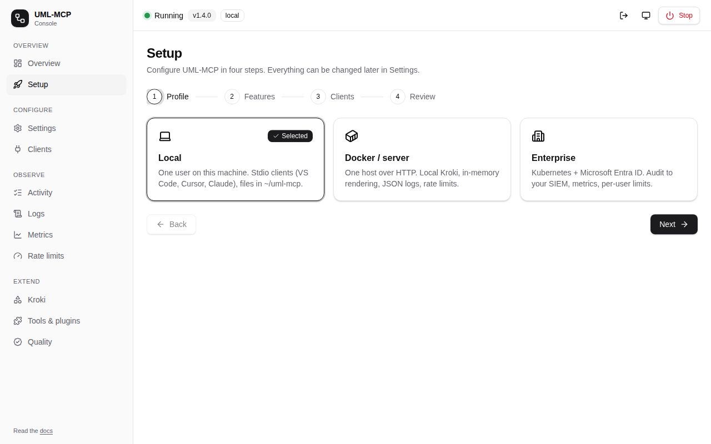
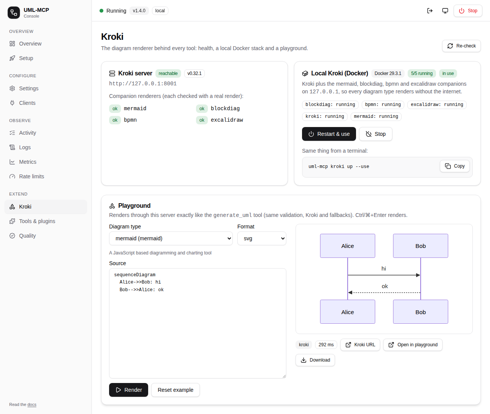
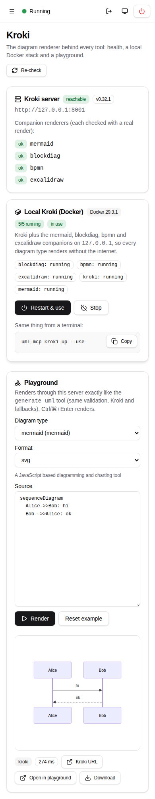
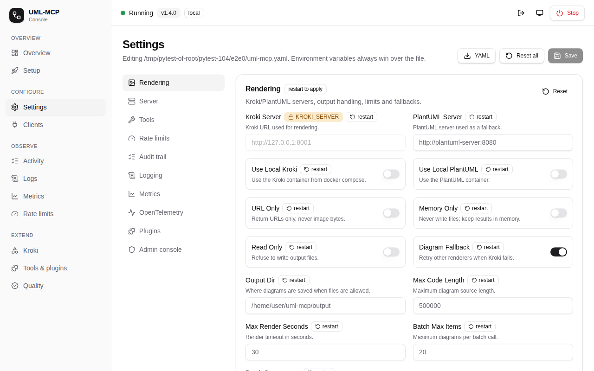
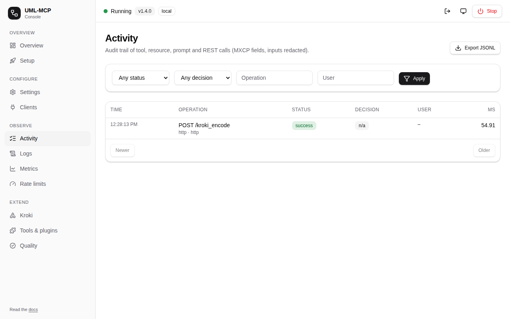
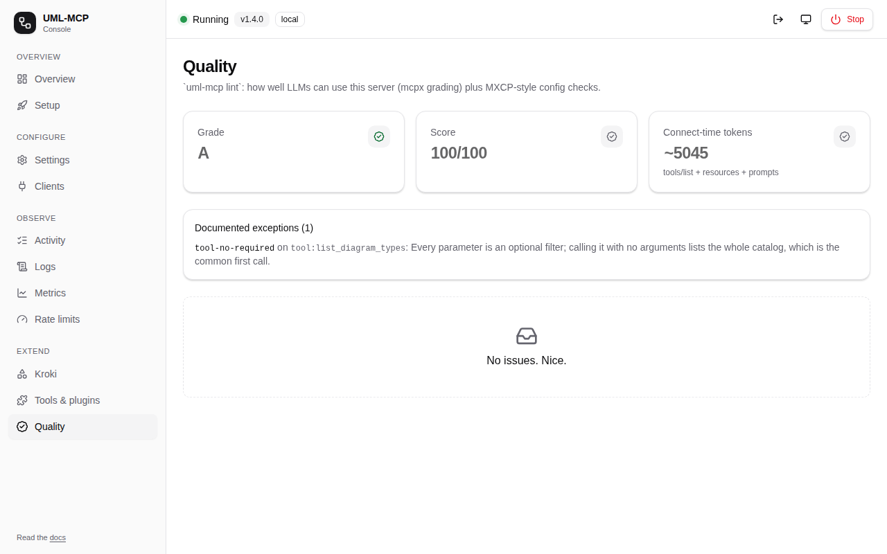
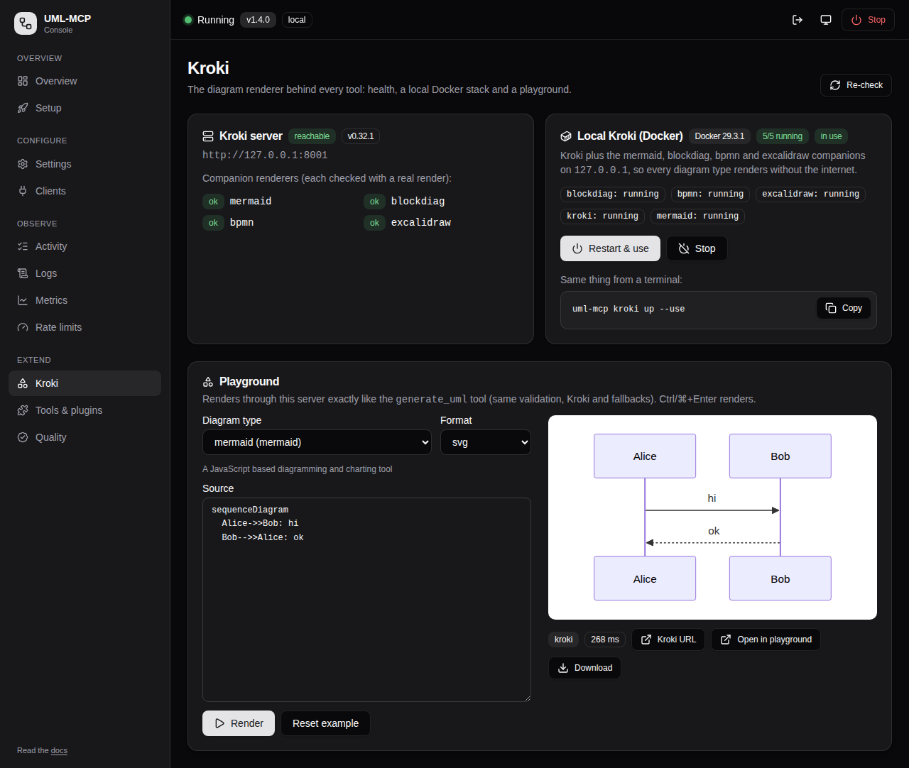

# Admin console user guide

Each section below is one task. You need a running console first; see
[Install the admin console](install.md). For a page-by-page reference, see the
[console tour](index.md).

!!! tip "Saving needs the setup token"
    In local mode you can look at everything, but saving, starting Kroki or registering a
    client needs the setup token printed by `uml-mcp admin`. Open the printed link, or use
    the key icon in the top bar.

## Finish first-run setup

1. Open **Setup** in the side menu.
2. **Profile:** choose **Local** (this machine), **Docker / server** or **Enterprise**.
3. **Features:** switch on what you need, such as **Audit trail** to fill the Activity
   page. The Kroki URL is set here too.
4. **Clients:** tick the MCP clients to register (VS Code, Cursor, Claude Desktop,
   Claude Code).
5. **Review:** check the YAML, then press **Save & finish**. The **Overview** checklist
   moves to done.

## Render a diagram in the Kroki playground

Use the playground to try diagram source before an agent does. It renders exactly like
the `generate_uml` tool: same validation, same Kroki, same fallbacks.

1. Open **Kroki** (under *Extend*).
2. **Diagram type:** pick one of the 37 types. Its example is loaded into **Source**.
3. **Format:** choose `svg` (sharp, searchable) or `png`.
4. Edit the source, then press **Render** (or Ctrl/⌘+Enter).
5. Use the result:
    - **Kroki URL** opens the rendered image.
    - **Open in playground** opens the editor for that language (for example
      mermaid.live), when one exists.
    - **Download** saves the SVG or PNG.

A syntax error is shown in red under the preview, with Kroki's message (for example
`syntax error in line 1`), so you can fix the source and render again.

## Check Kroki's health

The **Kroki server** card shows the configured URL, whether it answers, and its version.
Below it, each **companion renderer** (mermaid, blockdiag, bpmn, excalidraw) is checked
with a real render, so the card shows the reason whenever a type would fail. Press
**Re-check** after changing something.

The same check from a terminal: `uml-mcp kroki status`.

## Start a local Kroki with every companion

In local mode, the **Local Kroki (Docker)** card manages a Kroki stack on `127.0.0.1`:

1. **Start all & use:** pulls the images the first time, starts Kroki and the four
   companions, waits until each renders, then switches rendering to it. The switch is
   saved as `rendering.kroki_server` and applies immediately, with no restart.
2. **Badges:** once running, the card shows **5/5 running** and **in use**.
3. **Stop:** removes the containers. Rendering keeps pointing at the saved URL until you
   change it.

The card also shows the terminal command (`uml-mcp kroki up --use`). If Docker isn't
installed or running, the badge says so and the buttons stay disabled.

{ width="300" }

## Change a setting

1. Open **Settings**. Each section matches a block of `uml-mcp.yaml`.
2. Edit fields. A **file** badge marks values that come from the file. **Env-locked**
   fields are set by an environment variable and are read-only here.
3. Press **Save**. The message lists what applied **live** and what needs a **restart**.
4. **Reset** returns a section (or everything) to a profile's defaults. **Download YAML**
   gives you the file for GitOps.

## Connect an MCP client

**Clients** shows ready-to-copy configurations for VS Code/Copilot, Cursor, Claude Code,
Claude Desktop and plain stdio. In local mode, the **One-click local install** card has a
button per client (`vscode`, `cursor`, `claude-desktop`, `claude-code`) that writes the
client's config for you, backing up the old one first.

## See what agents did

- **Activity:** every tool, resource, prompt and admin call, with user, status, policy
  decision and duration. Filter, click a row for the full record, and export as JSONL.
  Needs **Audit trail** with the `memory` sink.
- **Logs:** a live tail with level filter, search, pause and download. Tokens and secrets
  are redacted before they reach the page.
- **Metrics:** calls, errors, denials and latency per tool.
- **Rate limits:** the policy in force and which callers were throttled.

## Check quality

**Quality** runs [`uml-mcp lint`](../developers/linting.md) on the live server: the grade
(A–F), the score (this server: 100/100), the token cost a client pays on connect, and any
**documented exceptions** with their reasons.

## Stop the server

**Stop** (top right) asks for confirmation, then shuts the server down gracefully. The
page then shows how to start it again. On Kubernetes the pod is restarted; enterprise
deployments need `admin.allow_stop: true`.

## Keyboard, dark mode and phones

- **Keyboard:** every action works from the keyboard (Tab to a control, Enter to use it).
- **Theme:** the monitor/sun/moon button cycles system, light and dark.
- **Phones:** below 768 px the menu becomes a sheet (☰). Each page is tested at 390 px wide
  with an accessibility (axe) scan.

