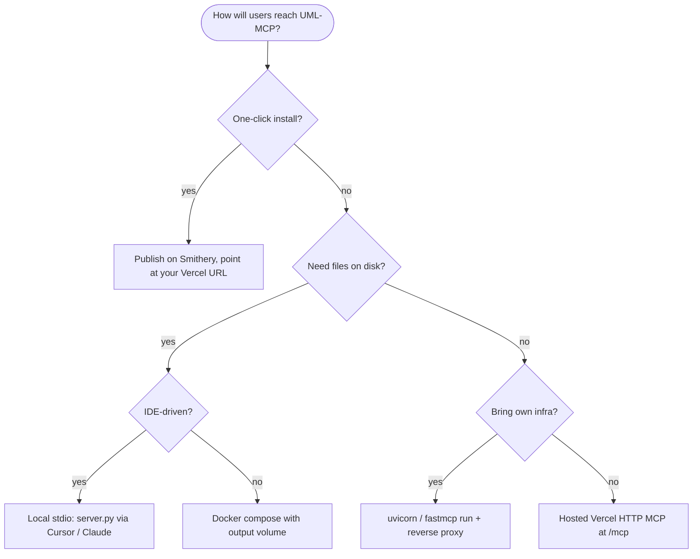

# Deploy

UML-MCP runs in four shapes. Pick the one that fits your environment, then jump to the matching guide.

-   :material-cloud-outline:{ .lg .middle } **Hosted (zero install)**

    ---

    Use the live Vercel endpoint via Streamable HTTP, or add the published Smithery server to your client.

    [:octicons-arrow-right-24: Vercel & Smithery](../integrations/vercel_smithery.md)

-   :material-console:{ .lg .middle } **Local stdio**

    ---

    Run `python server.py` from a clone. Cursor or Claude Desktop manage the process for you. Required for `output_dir` and full local control.

    [:octicons-arrow-right-24: Installation](../installation.md)

-   :material-docker:{ .lg .middle } **Docker**

    ---

    Self-contained stack with optional bundled Kroki and PlantUML. Use it for shared infra, air-gapped networks, or CI runners.

    [:octicons-arrow-right-24: Docker guide](docker.md)

-   :material-cog-transfer:{ .lg .middle } **Custom HTTP**

    ---

    Run the FastAPI app directly with `uvicorn` or `fastmcp run`, behind your own reverse proxy. MCP HTTP is mounted at `/mcp`.

    [:octicons-arrow-right-24: Configuration](../configuration.md)

## Decision tree

## Per-deployment specifics

| Concern | Hosted (Vercel) | Local stdio | Docker | Custom HTTP |
| --- | --- | --- | --- | --- |
| Transport | HTTP `/mcp` | stdio | HTTP `/mcp` | HTTP `/mcp` |
| File writes (`output_dir`) | No (read-only) | Yes | Yes (volume mount) | Yes |
| Local Kroki / PlantUML | No | Optional | Bundled | Optional |
| Auth / OAuth | Vercel Deployment Protection or open | None | None | Your choice |
| Best for | Public + Smithery distribution | IDE work, debugging | Air-gapped, shared infra | Behind your reverse proxy |

!!! note "MCP route"

    All HTTP deployments serve MCP at **`/mcp`**, never the domain root. Health endpoint is `/health` on the FastAPI app.

## Connecting clients

| Client | Setup guide |
| --- | --- |
| Cursor | [Cursor integration](../integrations/cursor.md) |
| Claude Desktop | [Claude Desktop integration](../integrations/claude_desktop.md) |
| Smithery (any registered client) | [Vercel & Smithery](../integrations/vercel_smithery.md) |

For the rendering fallback chain (Kroki → PlantUML → Mermaid.ink), see [Fallback strategy](../fallback-mechanism.md).
