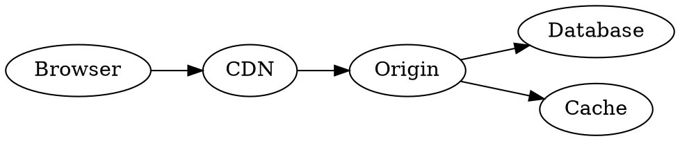

# D2, Graphviz, and other general-purpose diagrams

This page collects minimal, copy-paste-ready snippets for the non-UML, non-TikZ, non-Mermaid diagram types. Every backend uses the same `generate_uml` tool; only `diagram_type` and `code` change.

## D2

[D2](https://d2lang.com/) is a modern declarative diagram language with first-class layout engines.

```d2
service.frontend -> service.api: HTTP
service.api -> db: SQL
service.api -> cache: get/set
```

| Property | Value |
| --- | --- |
| `diagram_type` | `d2` |
| Backend | D2 (via Kroki) |
| Output formats | `svg` |

## Graphviz / DOT

[Graphviz](https://graphviz.org/) renders DOT graphs.



| Property | Value |
| --- | --- |
| `diagram_type` | `graphviz` |
| Backend | Graphviz (via Kroki) |
| Output formats | `png`, `svg`, `pdf`, `jpeg` |

## ERD

```erd
[Person]
*id
name
+account_id

[Account]
*id
balance

Person *--1 Account
```

| Property | Value |
| --- | --- |
| `diagram_type` | `erd` |
| Backend | erd (via Kroki) |
| Output formats | `png`, `svg`, `jpeg`, `pdf` |

## DBML

```dbml
Table users {
  id uuid [pk]
  email varchar [unique]
}

Table posts {
  id uuid [pk]
  author_id uuid [ref: > users.id]
  title varchar
}
```

| Property | Value |
| --- | --- |
| `diagram_type` | `dbml` |
| Backend | DBML (via Kroki) |
| Output formats | `svg` |

## BlockDiag family

The blockdiag family covers `blockdiag`, `seqdiag`, `actdiag`, `nwdiag`, `packetdiag`, `rackdiag`. All share the same DSL conventions.

```blockdiag
{
  Browser -> CDN -> WebApp -> Database;
  WebApp -> Cache;
}
```

| `diagram_type` | Description | Output formats |
| --- | --- | --- |
| `blockdiag` | Generic blocks | `png`, `svg`, `pdf` |
| `seqdiag` | Sequence | `png`, `svg`, `pdf` |
| `actdiag` | Activity | `png`, `svg`, `pdf` |
| `nwdiag` | Network | `png`, `svg`, `pdf` |
| `packetdiag` | Packet layout | `png`, `svg`, `pdf` |
| `rackdiag` | Server racks | `png`, `svg`, `pdf` |

## BPMN

```xml
<?xml version="1.0" encoding="UTF-8"?>
<bpmn:definitions xmlns:bpmn="http://www.omg.org/spec/BPMN/20100524/MODEL">
  <bpmn:process id="Approval" isExecutable="true">
    <bpmn:startEvent id="Start"/>
    <bpmn:task id="Submit" name="Submit request"/>
    <bpmn:endEvent id="End"/>
    <bpmn:sequenceFlow sourceRef="Start" targetRef="Submit"/>
    <bpmn:sequenceFlow sourceRef="Submit" targetRef="End"/>
  </bpmn:process>
</bpmn:definitions>
```

| Property | Value |
| --- | --- |
| `diagram_type` | `bpmn` |
| Backend | BPMN (via Kroki) |
| Output formats | `svg` |

[:octicons-arrow-right-24: Full BPMN guide](../tutorials/bpmn.md)

## C4 (PlantUML)

```plantuml
@startuml
!include https://raw.githubusercontent.com/plantuml-stdlib/C4-PlantUML/master/C4_Container.puml

Person(user, "User")
System_Boundary(c1, "UML-MCP") {
  Container(api, "FastAPI app", "Python")
  Container(mcp, "MCP server", "FastMCP")
}
Rel(user, api, "HTTPS")
Rel(api, mcp, "HTTP /mcp")
@enduml
```

| Property | Value |
| --- | --- |
| `diagram_type` | `c4plantuml` |
| Backend | PlantUML with C4 includes |
| Output formats | `png`, `svg`, `pdf`, `txt`, `base64` |

## Structurizr

```structurizr
workspace {
  model {
    user = person "User"
    system = softwareSystem "UML-MCP" {
      api = container "FastAPI"
      mcp = container "MCP server"
    }
    user -> api "HTTPS"
    api -> mcp "HTTP /mcp"
  }
  views { systemContext system { include * } }
}
```

| Property | Value |
| --- | --- |
| `diagram_type` | `structurizr` |
| Backend | Structurizr (via Kroki) |
| Output formats | `png`, `svg`, `pdf`, `txt`, `base64` |

## Specialty diagrams

| `diagram_type` | Use case |
| --- | --- |
| `excalidraw` | Hand-drawn whiteboard look |
| `bytefield` | Binary protocol byte layouts |
| `wavedrom` | Digital timing / waveform |
| `pikchr` | Pikchr scripting language (Fossil-style) |
| `nomnoml` | UML in shorthand |
| `svgbob` | ASCII art → SVG |
| `vega` / `vegalite` | Visualization grammars |

See [Diagram catalog](index.md) for the full table and [TikZ](tikz.md) for LaTeX-driven graphics.
