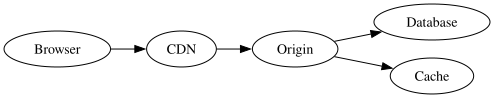

# Graphviz (DOT)

[Graphviz](https://graphviz.org/) renders [DOT](https://graphviz.org/doc/info/lang.html) graphs. UML-MCP sends DOT to Kroki with `diagram_type` set to `graphviz`.

## Example (source)

## Example (rendered SVG)

The SVG below was produced with `generate_uml` (`diagram_type: graphviz`, `output_format: svg`) against the snippet above, then committed under `docs/assets/diagrams/`.

## Parameters

| Property | Value |
| --- | --- |
| `diagram_type` | `graphviz` |
| Backend | Graphviz (via Kroki) |
| Output formats | `png`, `svg`, `pdf`, `jpeg` |

## See also

- [D2](d2.md) for D2 diagrams
- [More diagram backends](general.md) (hub: ERD, DBML, BlockDiag, BPMN, C4, Structurizr, specialty)
- [Diagram catalog](index.md) for the full `diagram_type` list
