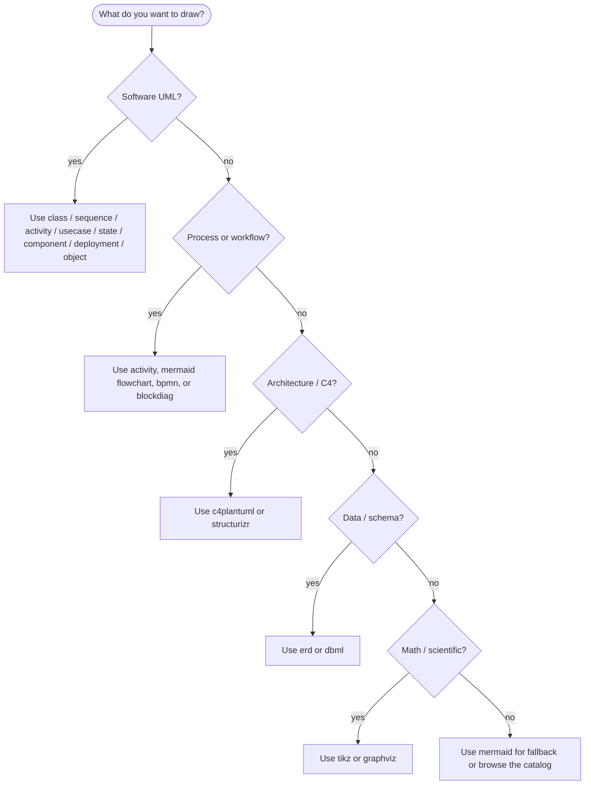

# Diagram types

UML-MCP exposes 30+ diagram types through a single tool surface. This page is the canonical catalog; the same data is served at runtime via the `uml://types`, `uml://formats`, and `uml://capabilities` resources.

!!! tip "Live data"

    For the authoritative list at runtime, ask the server: `tools/call list_diagram_types` or `resources/read uml://types`. The static tables below match the values defined in [`mcp_core/core/config.py`](https://github.com/antoinebou12/uml-mcp/blob/main/mcp_core/core/config.py).

## UML (PlantUML family)

All UML types are rendered through the PlantUML backend on Kroki.

| `diagram_type` | Description | Output formats |
| --- | --- | --- |
| `class` | Classes, attributes, methods, relationships | `png`, `svg`, `pdf`, `txt`, `base64` |
| `sequence` | Object interactions arranged in time | `png`, `svg`, `pdf`, `txt`, `base64` |
| `activity` | Workflows and business processes | `png`, `svg`, `pdf`, `txt`, `base64` |
| `usecase` | System functionality and actors | `png`, `svg`, `pdf`, `txt`, `base64` |
| `state` | Lifecycle states of an object | `png`, `svg`, `pdf`, `txt`, `base64` |
| `component` | Components and dependencies | `png`, `svg`, `pdf`, `txt`, `base64` |
| `deployment` | Physical architecture | `png`, `svg`, `pdf`, `txt`, `base64` |
| `object` | Class instances and their relationships | `png`, `svg`, `pdf`, `txt`, `base64` |
| `plantuml` | Raw PlantUML source (any diagram kind) | `png`, `svg`, `pdf`, `txt`, `base64` |
| `c4plantuml` | C4 model diagrams via PlantUML includes | `png`, `svg`, `pdf`, `txt`, `base64` |

[:octicons-arrow-right-24: UML page with examples](uml.md)

## General-purpose

| `diagram_type` | Backend | Description | Output formats |
| --- | --- | --- | --- |
| `mermaid` | Mermaid | Browser-native flowchart, sequence, class, state, Gantt, ER, pie | `svg`, `png` |
| `d2` | D2 | Modern declarative diagram language | `svg` |
| `graphviz` | Graphviz | Classic graph visualization (DOT) | `png`, `svg`, `pdf`, `jpeg` |
| `erd` | erd | Entity-relationship diagrams | `png`, `svg`, `jpeg`, `pdf` |
| `bpmn` | BPMN | Business Process Model & Notation | `svg` |
| `dbml` | DBML | Database Markup Language schemas | `svg` |
| `nomnoml` | nomnoml | UML-style diagrams from shorthand syntax | `svg` |

[:octicons-arrow-right-24: General-purpose page](general.md) · [Mermaid live examples](mermaid.md)

## blockdiag family

| `diagram_type` | Description | Output formats |
| --- | --- | --- |
| `blockdiag` | Simple block diagrams | `png`, `svg`, `pdf` |
| `seqdiag` | Sequence diagrams (blockdiag family) | `png`, `svg`, `pdf` |
| `actdiag` | Activity / workflow diagrams | `png`, `svg`, `pdf` |
| `nwdiag` | Network diagrams | `png`, `svg`, `pdf` |
| `packetdiag` | Network packet layouts | `png`, `svg`, `pdf` |
| `rackdiag` | Rack and server layouts | `png`, `svg`, `pdf` |

## Specialized

| `diagram_type` | Description | Output formats |
| --- | --- | --- |
| `tikz` | TikZ/PGF graphics (LaTeX) | `svg`, `pdf`, `png`, `jpeg` |
| `bytefield` | Binary protocol and byte layout | `svg` |
| `ditaa` | ASCII-art diagrams | `png`, `svg` |
| `excalidraw` | Whiteboard-style sketches | `svg` |
| `pikchr` | Pikchr diagram scripting language | `svg` |
| `structurizr` | C4 and architecture DSL | `png`, `svg`, `pdf`, `txt`, `base64` |
| `svgbob` | ASCII art to SVG | `svg` |
| `symbolator` | Digital logic / schematic symbols | (varies) |
| `vega` / `vegalite` | Visualization grammars | (varies) |
| `wavedrom` | Waveform and digital timing | `svg` |
| `wireviz` | Cable and wiring diagrams | (varies) |

[:octicons-arrow-right-24: TikZ page](tikz.md)

---

## Picking a `diagram_type`

!!! note "Format support varies"

    Not every diagram type supports every output format. `validate_uml` returns a clear error if you ask for an unsupported `output_format`; or check `uml://formats` first.
