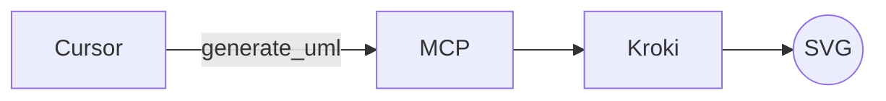
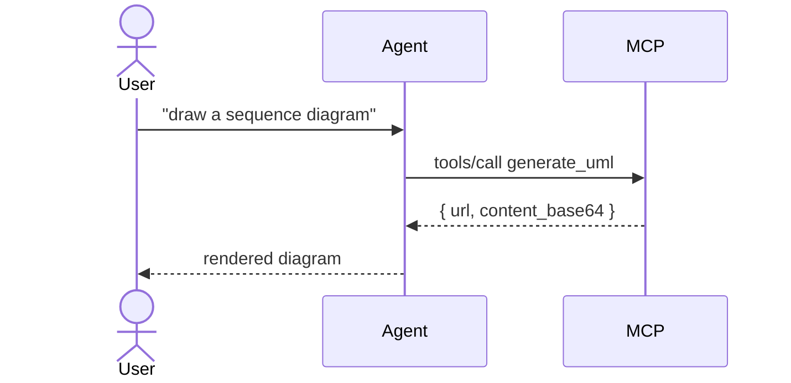
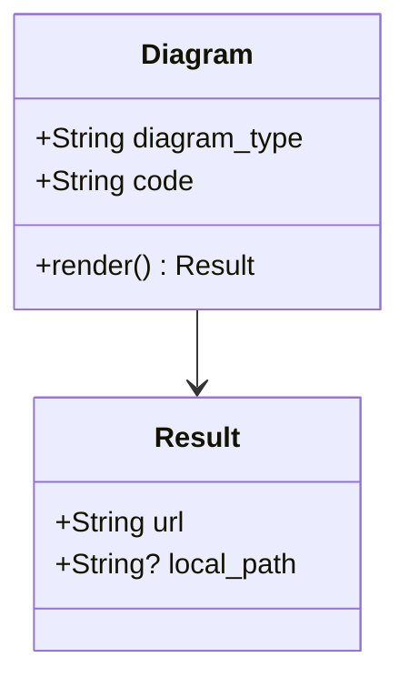
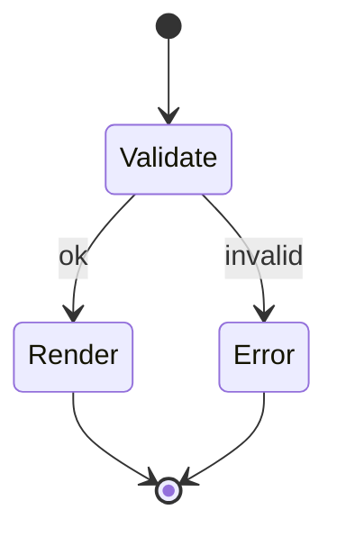

# Mermaid

[Mermaid](https://mermaid.js.org/) is a JavaScript-based text-to-diagram tool. UML-MCP renders Mermaid through Kroki (server-side) and falls back to [Mermaid.ink](https://mermaid.ink/) when needed.

| Property | Value |
| --- | --- |
| `diagram_type` | `mermaid` |
| Backend | Mermaid (via Kroki) → Mermaid.ink fallback |
| Output formats | `svg`, `png` |
| Resource shortcuts | `uml://templates` (key `mermaid`), `uml://mermaid-examples` |
| Prompts | `mermaid_sequence_api`, `mermaid_gantt`, `convert_class_to_mermaid` |

!!! tip "Browser-rendered preview vs server render"

    The blocks below render in your browser via Mermaid's runtime. Calling `generate_uml(diagram_type="mermaid", code=...)` returns a server-rendered SVG/PNG you can embed anywhere.

## Calling `generate_uml`

```json
{
  "name": "generate_uml",
  "arguments": {
    "diagram_type": "mermaid",
    "code": "flowchart LR; A-->B; A-->C;",
    "output_format": "svg"
  }
}
```

## Supported diagram kinds

Mermaid covers many shapes from a single backend. Pick the right opening keyword:

| Kind | Opening directive | Notes |
| --- | --- | --- |
| Flowchart | `flowchart LR` (or `graph TD`) | Use for control flow, decision trees, dependency graphs. |
| Sequence | `sequenceDiagram` | Pair with `participant`, `->>`, `-->>`, `alt`/`else`. |
| Class | `classDiagram` | Visibility prefixes: `+`, `-`, `#`, `~`. Relationships: `<|--`, `*--`, `o--`, `..>`. |
| State | `stateDiagram-v2` | Use `[*]` for start/end pseudostates. |
| ER | `erDiagram` | Cardinality: `||--o{`, `}|..|{`. |
| Gantt | `gantt` | Set `dateFormat` and `axisFormat`; sections group tasks. |
| Pie | `pie` | Add `showData` for numeric labels. |

## Quick samples

### Flowchart



### Sequence



### Class



### State



## Validation tips

!!! warning "Common pitfalls"

    - **Mismatched arrows**: `->>` (solid) vs `-->>` (dashed) in sequence diagrams; mixing breaks Kroki.
    - **Reserved keywords**: avoid `end`, `subgraph`, `graph`, `flowchart` as bare node IDs in flowcharts.
    - **Special characters in labels**: wrap with double quotes, for example `A["Process (main)"]`.

Run `validate_uml(diagram_type="mermaid", code=..., strict=true)` to surface these before calling Kroki.

See also: [Tutorials → Mermaid live examples](../tutorials/mermaid.md), [Diagram Assistant](../diagram-assistant.md).
