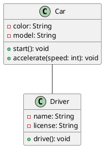
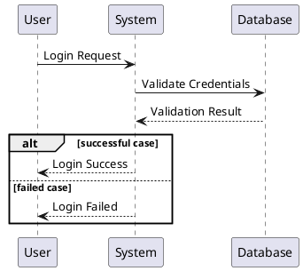
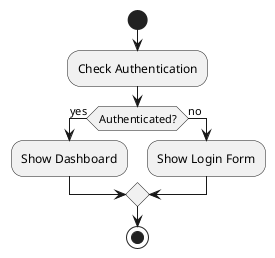
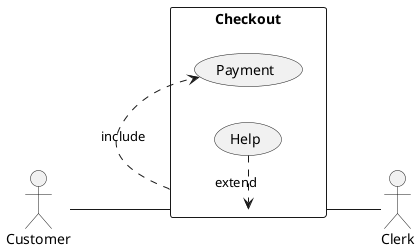
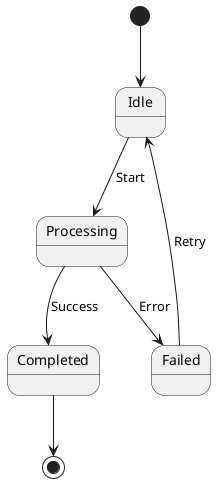
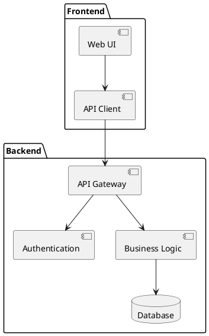

# UML (PlantUML)

UML-MCP supports the eight standard UML diagram types through the PlantUML backend on Kroki, plus a raw `plantuml` type for arbitrary `@startuml` source.

| `diagram_type` | Use it for |
| --- | --- |
| `class` | Static structure: classes, attributes, methods, relationships |
| `sequence` | Object interactions over time |
| `activity` | Workflows and business processes |
| `usecase` | Actors and system functionality |
| `state` | Object lifecycle states |
| `component` | Components and dependencies |
| `deployment` | Physical architecture |
| `object` | Class instances and their relationships |
| `plantuml` | Raw PlantUML (any kind) |

!!! tip "Plan before you generate"

    The default `uml_diagram_with_thinking` prompt produces a brief plan (purpose, elements, relationships) before the code, which dramatically improves first-shot diagram quality.

## Class Diagrams

Class diagrams show the static structure of a system:



## Sequence Diagrams

Sequence diagrams show object interactions arranged in time sequence:



## Activity Diagrams

Activity diagrams show workflows or business processes:



## Use Case Diagrams

Use case diagrams show system functionality and actors:



## State Diagrams

State diagrams show states of an object during its lifecycle:



## Component Diagrams

Component diagrams show components and dependencies:



## Tips for UML Diagrams

1. Use PlantUML preprocessor for advanced features:
   ```plantuml
   !include https://raw.githubusercontent.com/plantuml-stdlib/C4-PlantUML/master/C4_Container.puml
   ```

2. Apply themes for better visuals:
   ```plantuml
   @startuml
   !theme cerulean
   class Example
   @enduml
   ```

3. Use notes for additional information:
   ```plantuml
   @startuml
   class User
   note right of User: This class represents system users
   @enduml
   ```

---

## Related

- [Diagram catalog](index.md): all supported types with output formats.
- [Mermaid](mermaid.md): alternative syntax if you prefer Mermaid.
- [Tutorials, Getting started](../tutorials/getting-started.md): step-by-step generation walkthrough.
- [MCP tools reference](../api/tools.md).
