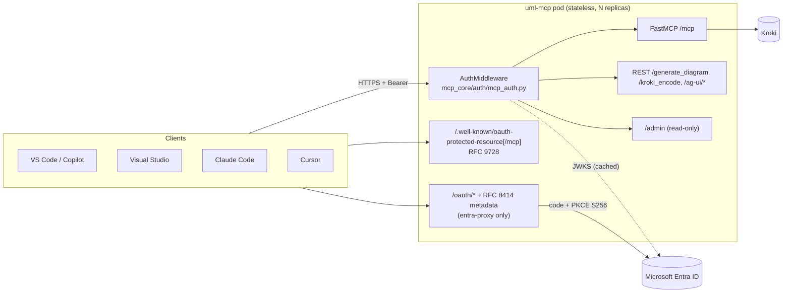
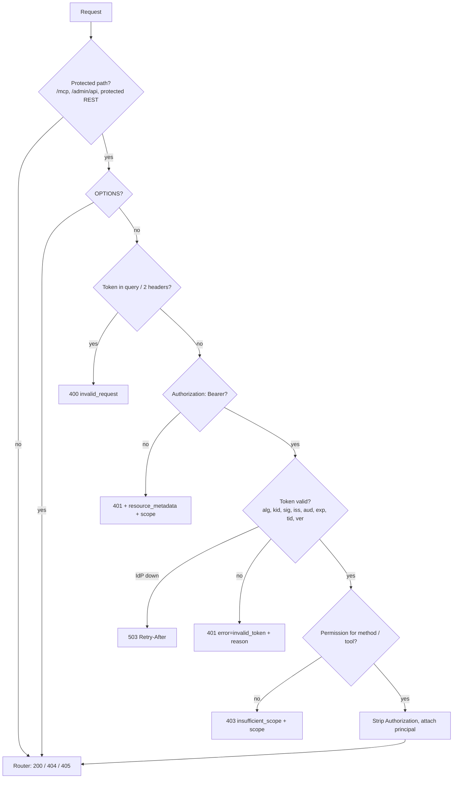
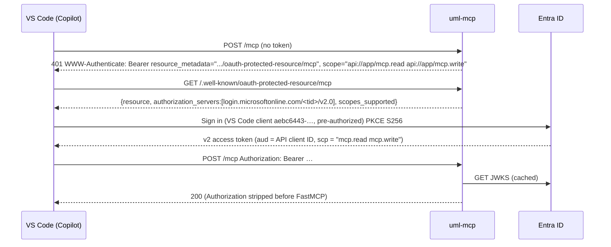
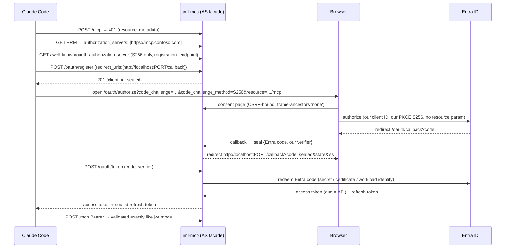

# Architecture

Enterprise auth is a small, **pure-ASGI layer** (`mcp_core/auth/`) in front of the
existing FastAPI app. It isn't FastMCP's built-in auth: that version cannot return
per-tool HTTP 403 responses, does not require `exp` or check `nbf`, ignores Entra
`roles`/`appid`, and its OAuth proxy needs shared storage.

## Components

The request passes the middlewares in this order:
`RequestId/RateLimit → Accept → Origin → CORS → AuthMiddleware → router`.
Auth sits inside CORS, so 401/403 responses carry CORS headers and preflights never
need a token. It sits after the Origin (DNS-rebinding) check.

## Decision flow for a protected request

## `jwt` mode: VS Code / Copilot with Entra ID

## `entra-proxy` mode: Claude Code, Cursor

**Stateless by design.** Client IDs, transactions, authorization codes and refresh
tokens are AES-256-GCM sealed blobs:

- A per-purpose HKDF key and an AAD bound to purpose, key ID and issuer, so a client ID
  can never pass as a code.
- Keys come from `MCP_AUTH_PROXY_ENCRYPTION_KEYS` and rotate with the first key used to
  encrypt.
- Any replica can finish any flow. Single use of codes is enforced by Entra
  (AADSTS54005), not by a local cache.

## Token validation pipeline

Cheap local checks run before any network call, and nothing is accepted without
full verification:

1. size ≤ 16 KiB, three segments, JSON header and payload
2. `alg` in the allow-list (default `RS256`; `none` and `HS*` are impossible to configure);
   `jku`/`x5u`/`jwk`/`crit` headers are rejected
3. unverified `iss` ∈ trusted issuers, `aud` ∈ accepted audiences, `exp` present
   and not expired. This produces precise 401 reasons and costs no JWKS fetch.
4. key by `kid` from the JWKS cache: 1 h TTL, refetch on unknown `kid` at most once
   per 60 s, stale-if-error for 24 h
5. `jwt.decode` (signature, `exp`/`nbf` with 60 s leeway, `iss`, `aud`)
6. Entra rules:
   - `tid` is a GUID and matches `iss`
   - tenant allow-list
   - `ver == "2.0"` (v1 is opt-in)
   - signing-key issuer check
   - `azp`/`appid` allow-list
   - ID tokens (`nonce`) rejected
7. permissions from `scp` (delegated) or `roles` (app-only), per Microsoft guidance

## Permissions

| Permission | Delegated scope | App role | Needed for |
| --- | --- | --- | --- |
| read | `mcp.read` (or `mcp.write`) | MCP.Reader, MCP.Read.All | `tools/list`, resources, prompts, `validate_uml`, `list_diagram_types`, `/kroki_encode` |
| write | `mcp.write` | MCP.Writer, MCP.Write.All | `generate_uml`, `generate_uml_batch`, `generate_uml_image`, `/generate_diagram`, AG-UI; unknown tools/methods (fail safe) |
| admin | none | MCP.Admin | `/admin/api/*` |

Tool classes come from each tool's `readOnlyHint` annotation. Admins can override them
with `tool_permissions`.

## Standards map

| Standard | Where |
| --- | --- |
| RFC 6750 (Bearer) | `WWW-Authenticate`, `invalid_request` / `invalid_token` / `insufficient_scope`, header-only tokens |
| RFC 9728 (Protected Resource Metadata) | `/.well-known/oauth-protected-resource[/mcp]`, `resource_metadata` challenge |
| RFC 8414 (AS Metadata) | `/.well-known/oauth-authorization-server` (entra-proxy) |
| RFC 7591 (Dynamic Client Registration) | `POST /oauth/register` (entra-proxy) |
| RFC 7636 (PKCE) | S256 required; `plain` refused |
| RFC 8707 (Resource Indicators) | `resource` validated against the MCP URL; audience binding; never forwarded to Entra |
| RFC 8252 (Native apps) | Loopback redirects on any port |
| RFC 9207 (`iss` in responses) | Every authorization redirect |
| RFC 9068 (JWT access tokens) | Optional `typ` check (`MCP_AUTH_TOKEN_TYPE=at+jwt`) |
| MCP 2025-11-25 authorization, SEP-2207 | Discovery, step-up 403, no token passthrough, `offline_access` not advertised in the resource metadata |
