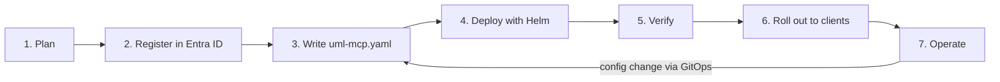

# Enterprise deployment guide

This is the end-to-end path from nothing to a governed, audited UML-MCP for your
organisation. Each step links to the detailed page.



## 1. Plan

| Decision | Options | Recommendation |
| --- | --- | --- |
| Auth mode | `jwt` · `entra-proxy` | `jwt` if your users are on VS Code / Copilot / Visual Studio; add `entra-proxy` for Claude Code / Cursor ([modes](README.md#pick-a-mode)) |
| Tools | all · allow-list | Allow-list only what people need (`tools.enabled`); keep `generate_uml_batch` for power users behind a tool rate limit |
| Rendering | public kroki.io · self-hosted Kroki | Self-host Kroki in the cluster so diagram source never leaves your network |
| Storage | memory-only · output dir | `memory_only: true` and `url_only: true` on Kubernetes (stateless, no PVC) |
| Audit | stream · file · memory | `stream` → your SIEM, plus `memory` for the admin dashboard |
| Who is admin | Entra app role `MCP.Admin` | A small platform group; assignment required on the enterprise app |

## 2. Register the API in Entra ID

```bash
python -m mcp_core.auth generate az-script \
  --resource-url https://mcp.contoso.com/mcp --tenant-id <tenant> > register.sh
bash register.sh
```

This creates:

- v2 tokens
- the `mcp.read` / `mcp.write` scopes and the app roles
- pre-authorization for VS Code and Visual Studio

Enable **Assignment required** and assign groups. Details: [Microsoft Entra ID](entra-id.md).

## 3. Write `uml-mcp.yaml`

```bash
uml-mcp config init --profile enterprise --path uml-mcp.yaml
# edit hosts, tenant/client IDs, tools, limits
uml-mcp config validate --config uml-mcp.yaml
UML_MCP_CONFIG=uml-mcp.yaml uml-mcp lint --strict
```

Commit it to your GitOps repository; the dashboard never changes configuration.
Secrets such as proxy encryption keys and client secrets go in Kubernetes Secrets or
Key Vault, never in the file; the loader rejects them.
Reference: [uml-mcp.yaml](../configuration/uml-mcp-yaml.md).

## 4. Deploy with Helm

Split the file: auth keys under `auth:`, everything else under `config:`.

```yaml
# values-prod.yaml
image: {repository: contoso.azurecr.io/uml-mcp, tag: "1.4.0"}
ingress: {enabled: true, className: nginx, hosts: [mcp.contoso.com],
          tls: [{secretName: uml-mcp-tls, hosts: [mcp.contoso.com]}]}
auth:
  mode: jwt
  resourceUrl: https://mcp.contoso.com/mcp
  entra: {tenantId: <tenant>, clientId: <api-client-id>}
admin: {enabled: true}
config:
  tools: {enabled: [list_diagram_types, validate_uml, generate_uml, generate_uml_image]}
  rate_limit: {enabled: true, key: principal, trusted_proxies: [10.0.0.0/8],
               default: {requests_per_minute: 120, burst: 30}}
  logging: {level: INFO, format: json}
  audit: {enabled: true, sinks: [stream, memory]}
  metrics: {enabled: true, endpoint: true}
env: {KROKI_SERVER: http://kroki:8000, MCP_URL_ONLY: "true"}
```

```bash
helm upgrade --install uml-mcp deploy/helm/uml-mcp -f values-prod.yaml -n uml-mcp
```

The chart then:

- runs as non-root with a read-only root filesystem
- has a network policy
- sets PDB and HPA
- fails fast on invalid values

Details: [Kubernetes (Helm)](kubernetes.md).

## 5. Verify

| Check | How |
| --- | --- |
| Discovery | `curl https://mcp.contoso.com/.well-known/oauth-protected-resource/mcp` |
| 401 challenge | `curl -i -X POST https://mcp.contoso.com/mcp` → `WWW-Authenticate: Bearer resource_metadata=…` |
| Scopes, 403, Graph audience | [`tests/http/entra-auth.http`](https://github.com/antoinebou12/uml-mcp/blob/main/tests/http/entra-auth.http) in VS Code REST Client / JetBrains |
| End to end | `MCP_SMOKE_TOKEN` set, then `uv run python scripts/run_mcp_smoke.py --url https://mcp.contoso.com/mcp` |
| Audit | Dashboard → **Activity** shows your calls with `policy_decision: allow` and your UPN |
| Readiness | Walk the [checklist](checklist.md) |

## 6. Roll out to clients

Generate client configs from the dashboard (**Clients** tab) or the CLI
(`python -m mcp_core.auth generate vscode|visual-studio|cursor|claude-code`).
Distribute them with your device management or a repository `.vscode/mcp.json`.
The [Copilot agent file](https://github.com/antoinebou12/uml-mcp/blob/main/.github/agents/uml-mcp.agent.md)
gives teams a ready-made "diagram assistant". Details: [Clients](clients.md).

## 7. Operate

- Ship the audit stream to your SIEM and alert on denials and rate-limit bursts.
- Scrape `/metrics` with an admin client-credentials token.
- Rotate the proxy encryption keys on a schedule.
- Review `uml-mcp lint` in CI on every change.

Details: [Operations](operations.md) · [Troubleshooting](troubleshooting.md).

## Best-practice mapping

How UML-MCP covers common enterprise MCP security guidance
([MintMCP](https://www.mintmcp.com/blog/mcp-security-enterprises),
[Atlan](https://atlan.com/know/ai-agent/how-to-build-mcp-servers-for-enterprise-data/),
[enterprise MCP architecture](https://medium.com/@arjun.vijay20/architecting-an-enterprise-grade-ai-mcp-solution-a-deep-dive-into-dynamic-tool-integration-with-f0a26c0010a0),
[MXCP](https://mxcp.dev)):

| Practice | UML-MCP control |
| --- | --- |
| Centralised identity, no shared keys | Entra ID / OIDC bearer tokens validated on every request; no API keys; tokens never forwarded to Kroki |
| Least privilege | `mcp.read` vs `mcp.write` scopes per tool (from `readOnlyHint`); app roles; `tools.enabled` allow-list removes tools entirely |
| Audit every action | MXCP-style record per tool/resource/prompt/REST call with user, session, decision, reason, duration; JSONL rotation; SIEM via stdout |
| Rate limiting and quotas | Token buckets per IP or user, per route and per tool; failed-auth throttling; `RateLimit-*` headers |
| Input validation | Strict JSON-RPC parsing (duplicate keys, BOM, size caps); `MCP_MAX_CODE_LENGTH`; render timeouts; `validate_uml` |
| Secret hygiene | Secrets only via env or `*_FILE` (rejected in YAML/JSON); redaction of tokens, secrets and diagram code in logs and audit |
| Network isolation | Ingress TLS, `NetworkPolicy`, self-hosted Kroki, `MCP_ALLOWED_HOSTS` / Origin checks (DNS-rebinding defence) |
| Observability | Request IDs end to end, JSON logs, metrics with p50/p95, admin dashboard |
| Quality gates | `uml-mcp lint --strict` in CI (descriptions, annotations, schemas, risky config) — [Linting](../developers/linting.md) |
| Change control | Read-only dashboard; configuration only through reviewed files (GitOps) |
