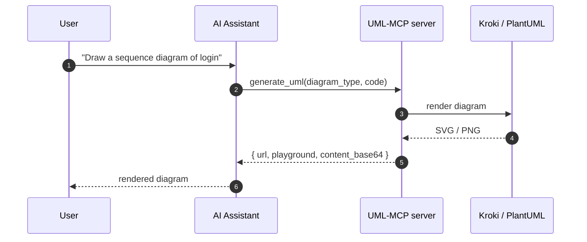

# UML-MCP

UML-MCP is an MCP server for diagram generation: AI assistants (Cursor, Claude Desktop, and any MCP-compatible client) can render UML, Mermaid, D2, TikZ, BPMN, C4, Graphviz, and 30+ other diagram types through [Kroki](https://kroki.io/), [PlantUML](https://plantuml.com/), [Mermaid](https://mermaid.js.org/), and [D2](https://d2lang.com/).

[](https://github.com/antoinebou12/uml-mcp/actions/workflows/test.yml)
[](https://github.com/antoinebou12/uml-mcp/actions/workflows/build.yml)
[](https://github.com/antoinebou12/uml-mcp/actions/workflows/docs.yml)
[](https://github.com/antoinebou12/uml-mcp/stargazers)
[](https://opensource.org/licenses/MIT)
[](https://www.python.org/downloads/)



[Get started in 5 minutes :material-rocket-launch:](tutorials/getting-started.md){ .md-button .md-button--primary }
[Browse the API reference :material-book-open-variant:](reference/index.md){ .md-button }
[Add to Cursor / Claude :material-puzzle:](deploy/index.md){ .md-button }

---

## Features

<div class="grid cards" markdown>

-   :material-shape-plus:{ .lg .middle } **30+ diagram types**

    ---

    UML (Class, Sequence, Activity, Use Case, State, Component, Deployment, Object), Mermaid, D2, Graphviz, TikZ, ERD, BlockDiag, BPMN, C4, all in one tool call.

    [:octicons-arrow-right-24: Diagram catalog](diagrams/index.md)

-   :material-tools:{ .lg .middle } **MCP-native tools**

    ---

    `generate_uml`, `validate_uml`, `list_diagram_types`, and `generate_uml_batch` are MCP tools with annotations (`readOnlyHint`, `idempotentHint`, etc.) and resource URIs under `uml://`.

    [:octicons-arrow-right-24: Tool reference](api/tools.md)

-   :material-file-export:{ .lg .middle } **Multiple output formats**

    ---

    SVG, PNG, PDF, JPEG, TXT, and base64, depending on diagram type. Save to disk, return a URL, or stream as base64. Configurable themes and SVG scale.

    [:octicons-arrow-right-24: Configuration](configuration.md)

-   :material-cloud-cog:{ .lg .middle } **Deployment options**

    ---

    Local stdio for IDE integration. HTTP for shared infra. Docker for offline. Vercel + Smithery for zero-install hosted MCP.

    [:octicons-arrow-right-24: Deploy guide](deploy/index.md)

-   :material-shield-check:{ .lg .middle } **Rendering with fallbacks**

    ---

    Kroki first, with optional fallback to a local PlantUML server or Mermaid.ink. Each response includes a `source` field naming the backend that produced the image.

    [:octicons-arrow-right-24: Fallback strategy](fallback-mechanism.md)

-   :material-school:{ .lg .middle } **Built-in tutorials**

    ---

    Step-by-step guides for connecting clients, generating your first diagram, validating, batching, theming, and converting between syntaxes.

    [:octicons-arrow-right-24: Tutorials](tutorials/index.md)

</div>

---

## Quick start

=== ":material-cloud-outline: Smithery (zero install)"

    Add the published server to your client without managing any process:

    ```bash
    npm install -g @smithery/cli@latest
    smithery auth login
    smithery mcp add antoinebou12/uml --client cursor
    ```

    Or use the legacy one-liner: `npx -y @smithery/cli install antoinebou12/uml --client claude`.

=== ":material-web: Hosted HTTP (Vercel)"

    Use the live deployment over Streamable HTTP:

    ```json
    {
      "mcpServers": {
        "uml-mcp": {
          "url": "https://uml-mcp.vercel.app/mcp"
        }
      }
    }
    ```

    The MCP route is `/mcp`, not the domain root.

=== ":material-console: Local stdio"

    Clone, install, run. Everything stays on your machine:

    ```bash
    git clone https://github.com/antoinebou12/uml-mcp.git
    cd uml-mcp
    uv sync
    uv run python server.py
    ```

    See [Installation](installation.md) for Poetry/pip variants.

=== ":material-docker: Docker"

    Run a self-contained stack with optional local Kroki/PlantUML:

    ```bash
    docker compose up -d
    # MCP HTTP available at http://127.0.0.1:8000/mcp
    ```

    See [Docker](deploy/docker.md) for stdio mode and local backends.

---

## Limitations

!!! note "What UML-MCP is not"

    - **Not a graphics editor.** It renders diagrams from textual sources; it does not let you draw with a mouse or hand-edit the rendered SVG.
    - **Not a Kroki/PlantUML replacement.** Rendering is delegated to Kroki, a PlantUML server, or Mermaid.ink. UML-MCP adds the MCP surface, validation, batching, and a fallback chain.
    - **Vercel runtime is read-only.** The hosted endpoint cannot write files: responses include URL + base64 only. Use a local install when you need `output_dir`.

!!! tip "Need an end-to-end stack?"

    Combine UML-MCP with your favourite MCP-aware editor. Cursor and Claude Desktop both work out of the box; see [Cursor](integrations/cursor.md), [Claude Desktop](integrations/claude_desktop.md), and [Claude Code](integrations/claude_code.md) (plugin + marketplace).

---

## Citation

If UML-MCP helps your research, tooling, or product, please cite the project or star the repo:

```bibtex
@software{uml_mcp,
  author = {Antoine Boucher and contributors},
  title  = {{UML-MCP: Diagram Generation via the Model Context Protocol}},
  url    = {https://github.com/antoinebou12/uml-mcp},
  year   = {2025}
}
```

[](https://star-history.com/#antoinebou12/uml-mcp&Date)

---

## License

UML-MCP is released under the [MIT License](https://github.com/antoinebou12/uml-mcp/blob/main/LICENSE). You can use, modify, and distribute it freely, including in commercial products, as long as you keep the original copyright and license notice. See the [About](about/index.md) page for acknowledgements.
