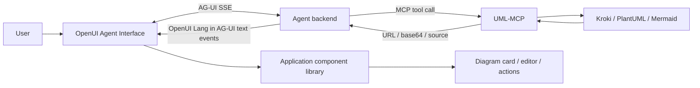

# OpenUI + UML-MCP

OpenUI and UML-MCP solve different parts of the same product problem.

UML-MCP gives an agent a reliable way to **create diagrams**. OpenUI gives a frontend a controlled way to **render model-generated interfaces from application-owned components**. AG-UI can sit between the agent and the frontend as the event stream.

That separation is useful. It means the diagram service does not need to become a chat framework, and the UI framework does not need to know how PlantUML, Mermaid, D2, or Kroki work.

## Where each layer fits

| Layer | Responsibility |
| --- | --- |
| **UML-MCP** | Validate and render diagrams. Expose diagram tools over MCP and diagram-run events over AG-UI. |
| **MCP** | Let an agent discover and call `generate_uml`, `generate_uml_image`, validation, and catalog tools. |
| **AG-UI** | Stream run, tool, state, text, and error events between an agent backend and a user-facing frontend. |
| **OpenUI Lang** | Describe generated interfaces using only the components your application allows. |
| **OpenUI renderer / Agent Interface** | Parse the stream, render real application components, and handle user interactions. |

OpenUI's own AG-UI integration uses `agUIAdapter()` to consume a standard AG-UI SSE stream. OpenUI Lang then remains the UI description layer rendered by the application's component library.

- OpenUI AG-UI integration: <https://www.openui.com/integrations/ag-ui>
- OpenUI Lang overview: <https://www.openui.com/docs/openui-lang/overview>
- OpenUI Generative UI: <https://www.openui.com/docs/agent/core-concepts/generative-ui>
- OpenUI adapters and formats: <https://www.openui.com/docs/agent/reference/adapters-and-formats>

## Recommended architecture

For a real generative-UI product, keep UML-MCP behind the agent as a tool instead of making the browser orchestrate diagram generation itself.



The agent can use the diagram result as data for a generated component such as a diagram card, architecture review panel, or editable design artifact.

## Connect an OpenUI frontend to AG-UI

OpenUI's `fetchLLM` can consume an endpoint that already emits AG-UI events:

```tsx
import {
  AgentInterface,
  agUIAdapter,
  fetchLLM,
} from "@openuidev/react-ui";

import { library } from "./openui-library";

const llm = fetchLLM({
  url: "/api/agent",
  streamAdapter: agUIAdapter(),
});

export function ArchitectureAssistant() {
  return (
    <AgentInterface
      llm={llm}
      componentLibrary={library}
    />
  );
}
```

The important part is `agUIAdapter()`: the frontend expects the server response to already be a standard AG-UI event stream.

For a complete AI-generated interface, `/api/agent` should be an **agent endpoint**, not just a diagram-render endpoint. It can call UML-MCP through `/mcp`, then stream the agent response back as AG-UI.

## What UML-MCP's `POST /ag-ui` does today

The canonical `POST /ag-ui` route in UML-MCP is deliberately narrower:

- it accepts a standard `RunAgentInput`-style envelope;
- it emits canonical AG-UI run, step, state, tool-call, result, custom, and error events;
- it renders one diagram through the existing UML-MCP pipeline;
- it does **not** run an LLM;
- it does **not** generate OpenUI Lang.

That makes the endpoint useful for AG-UI client compatibility, diagram-centric frontends, and protocol testing. It should not be described as a complete OpenUI agent backend.

If your product needs conversational generative UI, use an agent runtime in front of UML-MCP and let that runtime produce the OpenUI Lang response.

## Designing the OpenUI component library

OpenUI keeps component definitions inside the application. The model can compose only the components exposed by that library.

For an architecture or documentation product, a small library is usually better than a generic "render anything" surface. A useful starting set could be:

| Component | Purpose |
| --- | --- |
| `Diagram` | Render the UML-MCP URL or base64 result with a title and diagram type. |
| `DiagramSource` | Show editable Mermaid, PlantUML, or D2 source. |
| `ArchitectureFinding` | Present one design observation with evidence and severity. |
| `DecisionCard` | Capture a proposed architecture decision and trade-offs. |
| `FileReference` | Link a finding or diagram back to a source file or document. |
| `Actions` | Regenerate, open playground, copy source, or request a focused revision. |

Keep the renderers under application control. The model should choose from the component contract; it should not emit arbitrary executable frontend code.

## A practical agent flow

A useful architecture-review interaction can look like this:

1. The user asks the agent to explain a subsystem.
2. The agent inspects the relevant code or documentation.
3. The agent calls UML-MCP to create the appropriate diagram.
4. UML-MCP returns the rendered diagram plus editable source.
5. The agent produces OpenUI Lang that composes the diagram with findings, references, and actions.
6. AG-UI streams the response to the frontend.
7. OpenUI renders the generated interface progressively from the application's component library.

This keeps the model focused on composition and reasoning while UML-MCP owns diagram syntax and rendering.

## Why not return arbitrary HTML?

Generative UI works better when the application owns the component set. OpenUI builds its prompt, parser, and renderer around that component contract, so the generated interface stays aligned with the application's design system and available interactions.

For UML-MCP, the same rule is useful: return structured diagram data such as source, URL, format, and metadata, then let the frontend decide how that data appears.

## Which endpoint should I use?

| You are building... | Use |
| --- | --- |
| Cursor, Copilot, Claude, Codex, or another tool-using agent | UML-MCP `/mcp` |
| A small frontend that only needs to stream one diagram render | UML-MCP `/ag-ui` or legacy `/ag-ui/generate` |
| A conversational agent UI with standard event streaming | Your agent backend over AG-UI, with UML-MCP behind it over MCP |
| An AI-generated interface with cards, forms, tables, diagrams, and actions | OpenUI on the frontend + AG-UI agent stream + UML-MCP as a diagram tool |

## OpenUI skill for coding agents

OpenUI publishes an agent skill for assistants such as Claude Code, Codex, Cursor, and Copilot:

```bash
npx skills add thesysdev/skills --skill openui
```

The skill covers OpenUI Lang, component libraries, the renderer, packages, and debugging generated UI. See the upstream project for the maintained version:

<https://github.com/thesysdev/openui>

## Related UML-MCP docs

- [Frontend integration and canonical AG-UI endpoint](frontend.md)
- [MCP tools](../api/tools.md)
- [Architecture](../refactor-architecture-plan.md)
- [Getting started](../tutorials/getting-started.md)
