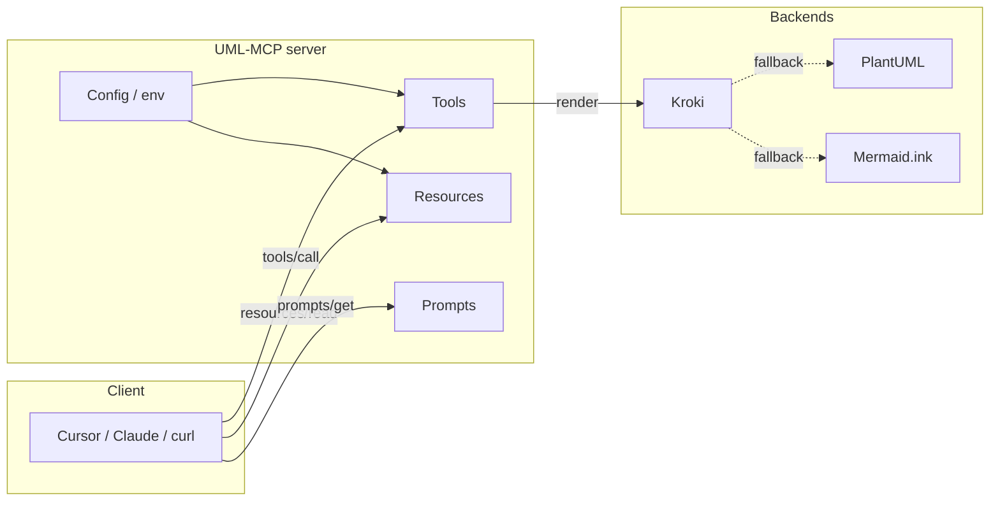

# Reference

Tools, resources, prompts, and Python modules exposed by UML-MCP. Use the table to open one topic per page.

| Section | What's here |
| --- | --- |
| [MCP tools](../api/tools.md) | `generate_uml`, `validate_uml`, `list_diagram_types`, `generate_uml_batch`. Parameters, returns, examples, fallback behavior. |
| [MCP resources](resources.md) | Full `uml://` URI catalog on one page: core discovery URIs plus Mermaid- and BPMN-focused resources (see the page for names and payloads). |
| [MCP prompts](prompts.md) | Registered named prompts for plan-then-generate, Mermaid sequence/Gantt, BPMN, C4, WireViz, class-to-Mermaid, and more. |
| [Python API](python/index.md) | Auto-generated reference for `mcp_core` and `tools.kroki` modules (mkdocstrings). |
| [Configuration](../configuration.md) | Environment variables, MCP client config, fallback knobs, server card, Smithery / Vercel options. |

## How the surfaces fit together

- **Tools** are the side-effecting surface (rendering, validation, batching).
- **Resources** are read-only data (types, templates, examples, server info).
- **Prompts** are named text templates the client can fetch with `prompts/get` and pass into the model context.
- **Configuration** controls runtime behavior (servers, fallback, output, rate limits).

!!! tip "Live discovery"

    `tools/list`, `resources/list`, `prompts/list` always reflect what's registered in the running server. The static pages below are kept in sync with the source files referenced in each section.
