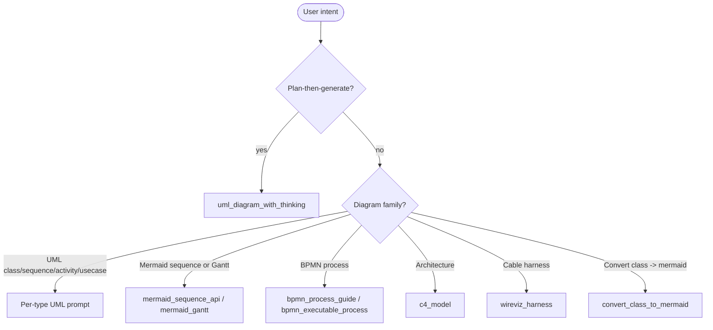

# MCP prompts

Prompts are named text templates an MCP client can fetch with `prompts/get` and pass into the model context. UML-MCP registers 13 prompts across UML, Mermaid, BPMN, C4, and hardware/wiring categories. Source of truth: [`mcp_core/prompts/diagram_prompts.py`](https://github.com/antoinebou12/uml-mcp/blob/main/mcp_core/prompts/diagram_prompts.py).

## Calling a prompt

```json
{
  "jsonrpc": "2.0",
  "id": 1,
  "method": "prompts/get",
  "params": {
    "name": "uml_diagram_with_thinking",
    "arguments": { "diagram_type": "sequence" }
  }
}
```

Most prompts accept an optional `context` dict. The most common key is `diagram_type`, which selects the diagram type for the prompt.

## General UML

| Prompt | Purpose |
| --- | --- |
| `uml_diagram` | Base prompt: read `uml://types` and `uml://formats`, plan, then call `generate_uml` with raw source. |
| `uml_diagram_with_thinking` | Same workflow with explicit planning step ("Before writing code, briefly plan…"). Use this for complex diagrams. |

## Per-type UML

| Prompt | Output |
| --- | --- |
| `class_diagram` | PlantUML class diagram from natural-language description; visibility, inheritance, composition, associations. |
| `sequence_diagram` | PlantUML sequence diagram with participants, lifelines, messages, activations. |
| `activity_diagram` | PlantUML activity diagram with start/end, decisions, forks, joins, swimlanes. |
| `usecase_diagram` | PlantUML use case diagram with actors, system boundary, include/extend. |

## Mermaid

| Prompt | Output |
| --- | --- |
| `mermaid_sequence_api` | Mermaid `sequenceDiagram` for an API call (client, API, optional Auth/DB, request/response, optional `alt` blocks). |
| `mermaid_gantt` | Mermaid `gantt` chart with title, `dateFormat`, sections, dependencies (`after`), durations. |
| `convert_class_to_mermaid` | Convert a PlantUML class diagram (or prose description) into Mermaid `classDiagram`. |

[:octicons-arrow-right-24: Live Mermaid examples](../tutorials/mermaid.md)

## BPMN

| Prompt | Output |
| --- | --- |
| `bpmn_process_guide` | Explains how to draw a BPMN process model (BPMN 2.0.2-aligned), pairs with `uml://bpmn-guide`. |
| `bpmn_executable_process` | Produces minimal executable BPMN 2.0 XML: start, tasks, gateways, end, sequenceFlow. |

[:octicons-arrow-right-24: BPMN tutorial](../tutorials/bpmn.md)

## Architecture

| Prompt | Output |
| --- | --- |
| `c4_model` | C4 diagrams using PlantUML C4 includes: context or container views with relationships. |

## Hardware / wiring

| Prompt | Output |
| --- | --- |
| `wireviz_harness` | WireViz YAML for cable/connector harnesses: connectors, cables, colors, pins. |

---

## Choosing the right prompt



!!! tip "Prompt + tool together"

    All prompts end by instructing the model to call `generate_uml` with the right `diagram_type`. Combined with the `uml://workflow` resource, you get plan → code → render in a single MCP turn.
