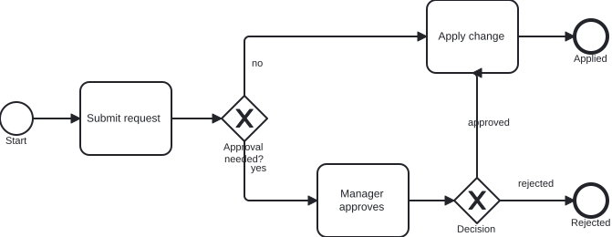

# BPMN prompts and SVG

Use this track when you want **BPMN 2.0** process models as **XML** rendered to **SVG** through Kroki (`diagram_type: bpmn`). For a compact element and flow reference, see the [BPMN guide](bpmn.md). For minimal XML syntax, see [BPMN (Kroki XML)](../diagrams/bpmn.md).

## Prerequisites

- A connected **UML-MCP** server ([Getting started](getting-started.md)).
- Optional: a **Sequential Thinking** MCP server in the same client if you want explicit multi-step reasoning *before* calling `generate_uml`. It is **not** part of UML-MCP; it complements `uml_diagram_with_thinking`, which is a **named prompt** on UML-MCP only.

## Natural-language prompts (copy-paste)

Ask your assistant in plain language, then let it load `uml://templates` (key `bpmn`), `uml://examples` (key `bpmn`) if helpful, and call **`generate_uml`** with `diagram_type: bpmn`:

```
Model a change approval in BPMN 2.0 XML: start, submit change request, exclusive gateway "needs manager approval?",
if no go straight to apply task and end applied; if yes manager review task, then exclusive gateway for approved vs rejected,
approved merges to apply then end applied, rejected ends at a separate end event. Include BPMN-DI shapes and edges so Kroki can lay it out.
```

```
BPMN XML for employee onboarding: parallel gateway after "documents received" so HR runs background check and IT provisions accounts in parallel,
then an inclusive join before a single "ready to start" task and end. Use pools only if I need two participants; otherwise one pool with lanes for HR and IT.
```

```
Two-pool BPMN handoff: Customer pool with "send order" message flow to Supplier pool "receive order" and sequence flows inside each pool. Keep it minimal and executable.
```

```
Single pool with two lanes (Requester, Approver): task submit in Requester lane, gateway and approve task in Approver lane, apply back in Requester lane. Output BPMN 2.0 XML with DI.
```

## Example Sequential Thinking flow (then `generate_uml`)

1. **Scope:** Happy path plus one rejection branch; one or two exclusive gateways.
2. **Notation:** BPMN 2.0 XML with `bpmn:` and `bpmndi:` namespaces; add **BPMNDiagram** so layout is stable in Kroki.
3. **Elements:** Stable IDs on `sequenceFlow` links; gateway outgoing flows named where it helps readers.
4. **Risks:** Missing DI often still renders for tiny models; for branching processes, include `BPMNShape` and `BPMNEdge` waypoints.
5. **Validation:** Call `validate_uml` with `diagram_type: bpmn` and the same `code`, then `generate_uml` with **`"output_format": "svg"`**; omit `output_dir` if you only need a URL or `content_base64`.

## Named MCP prompts (UML-MCP)

| Prompt | Use when |
| --- | --- |
| `uml_diagram` | Generic plan-then-generate for any supported type (steer toward `bpmn` in context). |
| `uml_diagram_with_thinking` | Same, with an explicit planning step before XML. |
| `bpmn_process_guide` | Explain BPMN elements and flow rules (BPMN 2.0.2); pairs with `uml://templates` / `uml://examples` (bpmn) and the [BPMN guide](bpmn.md). |
| `bpmn_executable_process` | Produce minimal executable BPMN 2.0 XML (start, tasks, gateways, end, `sequenceFlow`). |

Fetch text with `prompts/get` (see [MCP prompts](../reference/prompts.md)).

## Direct `tools/call` (JSON-RPC)

Minimal example for the diagram below (same `code` as the committed SVG): BPMN **ApprovalProcess** with two exclusive gateways (approval needed?, then outcome), **Apply change**, and two end events.

```json
{
  "jsonrpc": "2.0",
  "id": 1,
  "method": "tools/call",
  "params": {
    "name": "generate_uml",
    "arguments": {
      "diagram_type": "bpmn",
      "output_format": "svg",
      "code": "<?xml version=\"1.0\" encoding=\"UTF-8\"?>\n<bpmn:definitions xmlns:bpmn=\"http://www.omg.org/spec/BPMN/20100524/MODEL\"\n                  xmlns:bpmndi=\"http://www.omg.org/spec/BPMN/20100524/DI\"\n                  xmlns:dc=\"http://www.omg.org/spec/DD/20100524/DC\"\n                  xmlns:di=\"http://www.omg.org/spec/DD/20100524/DI\"\n                  id=\"Definitions_Tutorial\"\n                  targetNamespace=\"http://uml-mcp/tutorial/bpmn\">\n  <bpmn:process id=\"ApprovalProcess\" isExecutable=\"true\">\n    <bpmn:startEvent id=\"StartEvent_1\" name=\"Start\"/>\n    <bpmn:task id=\"Task_Submit\" name=\"Submit request\"/>\n    <bpmn:exclusiveGateway id=\"Gateway_ApprovalNeeded\" name=\"Approval needed?\"/>\n    <bpmn:task id=\"Task_Manager\" name=\"Manager approves\"/>\n    <bpmn:exclusiveGateway id=\"Gateway_Outcome\" name=\"Decision\"/>\n    <bpmn:task id=\"Task_Apply\" name=\"Apply change\"/>\n    <bpmn:endEvent id=\"End_Applied\" name=\"Applied\"/>\n    <bpmn:endEvent id=\"End_Rejected\" name=\"Rejected\"/>\n    <bpmn:sequenceFlow id=\"Flow_Start_Submit\" sourceRef=\"StartEvent_1\" targetRef=\"Task_Submit\"/>\n    <bpmn:sequenceFlow id=\"Flow_Submit_Gw1\" sourceRef=\"Task_Submit\" targetRef=\"Gateway_ApprovalNeeded\"/>\n    <bpmn:sequenceFlow id=\"Flow_Gw1_Apply\" name=\"no\" sourceRef=\"Gateway_ApprovalNeeded\" targetRef=\"Task_Apply\"/>\n    <bpmn:sequenceFlow id=\"Flow_Gw1_Manager\" name=\"yes\" sourceRef=\"Gateway_ApprovalNeeded\" targetRef=\"Task_Manager\"/>\n    <bpmn:sequenceFlow id=\"Flow_Manager_Gw2\" sourceRef=\"Task_Manager\" targetRef=\"Gateway_Outcome\"/>\n    <bpmn:sequenceFlow id=\"Flow_Gw2_Apply\" name=\"approved\" sourceRef=\"Gateway_Outcome\" targetRef=\"Task_Apply\"/>\n    <bpmn:sequenceFlow id=\"Flow_Gw2_Rejected\" name=\"rejected\" sourceRef=\"Gateway_Outcome\" targetRef=\"End_Rejected\"/>\n    <bpmn:sequenceFlow id=\"Flow_Apply_End\" sourceRef=\"Task_Apply\" targetRef=\"End_Applied\"/>\n  </bpmn:process>\n  <bpmndi:BPMNDiagram id=\"BPMNDiagram_1\">\n    <bpmndi:BPMNPlane id=\"BPMNPlane_1\" bpmnElement=\"ApprovalProcess\">\n      <bpmndi:BPMNShape id=\"Shape_Start\" bpmnElement=\"StartEvent_1\">\n        <dc:Bounds x=\"132\" y=\"232\" width=\"36\" height=\"36\"/>\n      </bpmndi:BPMNShape>\n      <bpmndi:BPMNShape id=\"Shape_Submit\" bpmnElement=\"Task_Submit\">\n        <dc:Bounds x=\"220\" y=\"210\" width=\"100\" height=\"80\"/>\n      </bpmndi:BPMNShape>\n      <bpmndi:BPMNShape id=\"Shape_Gw1\" bpmnElement=\"Gateway_ApprovalNeeded\" isMarkerVisible=\"true\">\n        <dc:Bounds x=\"375\" y=\"225\" width=\"50\" height=\"50\"/>\n      </bpmndi:BPMNShape>\n      <bpmndi:BPMNShape id=\"Shape_Manager\" bpmnElement=\"Task_Manager\">\n        <dc:Bounds x=\"480\" y=\"300\" width=\"100\" height=\"80\"/>\n      </bpmndi:BPMNShape>\n      <bpmndi:BPMNShape id=\"Shape_Gw2\" bpmnElement=\"Gateway_Outcome\" isMarkerVisible=\"true\">\n        <dc:Bounds x=\"630\" y=\"315\" width=\"50\" height=\"50\"/>\n      </bpmndi:BPMNShape>\n      <bpmndi:BPMNShape id=\"Shape_Apply\" bpmnElement=\"Task_Apply\">\n        <dc:Bounds x=\"600\" y=\"120\" width=\"100\" height=\"80\"/>\n      </bpmndi:BPMNShape>\n      <bpmndi:BPMNShape id=\"Shape_EndApplied\" bpmnElement=\"End_Applied\">\n        <dc:Bounds x=\"762\" y=\"142\" width=\"36\" height=\"36\"/>\n      </bpmndi:BPMNShape>\n      <bpmndi:BPMNShape id=\"Shape_EndRejected\" bpmnElement=\"End_Rejected\">\n        <dc:Bounds x=\"762\" y=\"322\" width=\"36\" height=\"36\"/>\n      </bpmndi:BPMNShape>\n      <bpmndi:BPMNEdge id=\"Edge_Flow_Start_Submit\" bpmnElement=\"Flow_Start_Submit\">\n        <di:waypoint x=\"168\" y=\"250\"/>\n        <di:waypoint x=\"220\" y=\"250\"/>\n      </bpmndi:BPMNEdge>\n      <bpmndi:BPMNEdge id=\"Edge_Flow_Submit_Gw1\" bpmnElement=\"Flow_Submit_Gw1\">\n        <di:waypoint x=\"320\" y=\"250\"/>\n        <di:waypoint x=\"375\" y=\"250\"/>\n      </bpmndi:BPMNEdge>\n      <bpmndi:BPMNEdge id=\"Edge_Flow_Gw1_Apply\" bpmnElement=\"Flow_Gw1_Apply\">\n        <di:waypoint x=\"400\" y=\"225\"/>\n        <di:waypoint x=\"400\" y=\"160\"/>\n        <di:waypoint x=\"600\" y=\"160\"/>\n      </bpmndi:BPMNEdge>\n      <bpmndi:BPMNEdge id=\"Edge_Flow_Gw1_Manager\" bpmnElement=\"Flow_Gw1_Manager\">\n        <di:waypoint x=\"400\" y=\"275\"/>\n        <di:waypoint x=\"400\" y=\"340\"/>\n        <di:waypoint x=\"480\" y=\"340\"/>\n      </bpmndi:BPMNEdge>\n      <bpmndi:BPMNEdge id=\"Edge_Flow_Manager_Gw2\" bpmnElement=\"Flow_Manager_Gw2\">\n        <di:waypoint x=\"580\" y=\"340\"/>\n        <di:waypoint x=\"630\" y=\"340\"/>\n      </bpmndi:BPMNEdge>\n      <bpmndi:BPMNEdge id=\"Edge_Flow_Gw2_Apply\" bpmnElement=\"Flow_Gw2_Apply\">\n        <di:waypoint x=\"655\" y=\"315\"/>\n        <di:waypoint x=\"655\" y=\"200\"/>\n        <di:waypoint x=\"650\" y=\"200\"/>\n      </bpmndi:BPMNEdge>\n      <bpmndi:BPMNEdge id=\"Edge_Flow_Gw2_Rejected\" bpmnElement=\"Flow_Gw2_Rejected\">\n        <di:waypoint x=\"680\" y=\"340\"/>\n        <di:waypoint x=\"762\" y=\"340\"/>\n      </bpmndi:BPMNEdge>\n      <bpmndi:BPMNEdge id=\"Edge_Flow_Apply_End\" bpmnElement=\"Flow_Apply_End\">\n        <di:waypoint x=\"700\" y=\"160\"/>\n        <di:waypoint x=\"762\" y=\"160\"/>\n      </bpmndi:BPMNEdge>\n    </bpmndi:BPMNPlane>\n  </bpmndi:BPMNDiagram>\n</bpmn:definitions>\n"
    }
  }
}
```

## Example output (server-rendered SVG)

This asset was produced with Kroki via UML-MCP `generate_uml` (`diagram_type: bpmn`, `output_format: svg`) and the same `code` as above.


