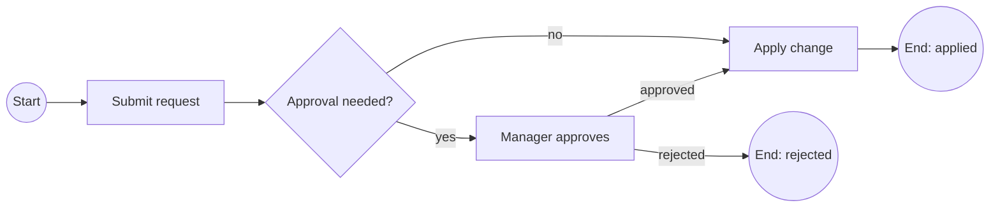

# BPMN guide

This page is a compact BPMN 2.0.2 reference for the docs site; for the full specification see the [OMG BPMN page](https://www.omg.org/spec/BPMN/2.0.2/).

!!! tip "Load BPMN starters via MCP"

    MCP clients can fetch minimal BPMN XML from **`uml://templates`** (read the **`bpmn`** key in the JSON payload):

    ```json
    {
      "jsonrpc": "2.0",
      "id": 1,
      "method": "resources/read",
      "params": { "uri": "uml://templates" }
    }
    ```

    Use **`uml://examples`** the same way for a fuller BPMN example (key **`bpmn`**).

## Core elements

| Element | Notation | Purpose |
| --- | --- | --- |
| **Start Event** | Circle, single border | Process trigger. |
| **End Event** | Circle, thick border | Process end. |
| **Task** | Rounded rectangle | Work performed in the process. |
| **Gateway** | Diamond: `X` exclusive, `+` parallel, `O` inclusive | Branch or merge control flow. |
| **Sequence Flow** | Solid arrow | Order of flow between elements. |
| **Message Flow** | Dashed arrow | Message between pools. |
| **Lane** | Sub-partition of a pool | Group tasks by role or system. |
| **Pool** | Outer boundary | Process or participant boundary. |

## Flow rules

- Each process has at least one Start Event and one End Event.
- Sequence flows connect activities, events, and gateways (never message flows).
- Gateways split or merge flows. Pick the right kind:
    * Exclusive (`X`): one path of many.
    * Parallel (`+`): all paths in parallel.
    * Inclusive (`O`): one or more paths based on conditions.
- Lanes group tasks by role or system within a pool. Pools represent independent participants.

## Reference flow (Mermaid sketch)

The diagram below is a Mermaid sketch of a typical "approval" BPMN process. For an executable BPMN 2.0 XML model, use the `bpmn_executable_process` prompt and the `uml://templates` resource (key `bpmn`). For copy-paste prompts, a full `tools/call` JSON example, and a committed Kroki SVG, see [BPMN prompts and SVG](bpmn-prompts-svg.md).



## Generating BPMN

```json
{
  "name": "generate_uml",
  "arguments": {
    "diagram_type": "bpmn",
    "code": "<BPMN 2.0 XML or BPMN-DI snippet>"
  }
}
```

- The `bpmn` diagram type renders to **SVG** through Kroki.
- For an executable BPMN starter, use the `bpmn_executable_process` prompt or read the `bpmn` template from `uml://templates`.
- For a process explanation rather than rendering, use the `bpmn_process_guide` prompt.
- For minimal XML syntax, see [BPMN (Kroki XML)](../diagrams/bpmn.md).

See also: [BPMN prompts and SVG](bpmn-prompts-svg.md), [Diagram Assistant](../diagram-assistant.md), and [MCP resources reference](../reference/resources.md).
