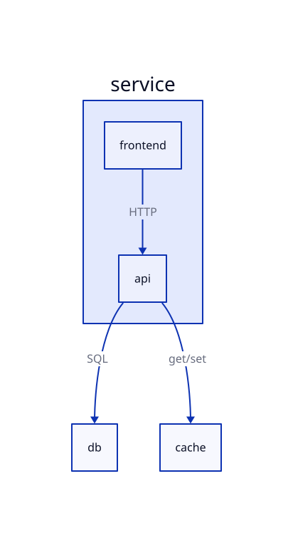

# D2 prompts and SVG

[D2](https://d2lang.com/) fits **boxes-and-arrows** system sketches (services, data stores, queues) with automatic layout. UML-MCP renders D2 through Kroki. For a minimal snippet reference, see [D2 / Graphviz / others](../diagrams/general.md#d2).

## Prerequisites

- Connected **UML-MCP** ([Getting started](getting-started.md)).
- Optional **Sequential Thinking** MCP for structured decomposition before tool calls (separate from UML-MCP).

D2 does **not** have an extra named prompt in UML-MCP beyond the general **`uml_diagram`** and **`uml_diagram_with_thinking`** workflows. Pass `diagram_type: "d2"` after planning.

## Natural-language prompts (copy-paste)

```
Draw a D2 diagram: browser hits a CDN, CDN misses go to origin API, API reads PostgreSQL
and Redis cache. Label connections HTTP, SQL, and cache get/set.
```

```
D2 architecture: mobile app -> BFF -> gRPC to user-service and catalog-service;
catalog-service -> object storage for assets. No colors, keep labels short.
```

```
Small D2: CI runner triggers deploy job, deploy job talks to Kubernetes API,
Kubernetes pulls images from container registry.
```

## Example Sequential Thinking flow (then `generate_uml`)

1. **Scope** — Three tiers: frontend, API, data.
2. **Notation** — D2 connections with labels, no nested containers for the first draft.
3. **Entities** — `service.frontend`, `service.api`, `db`, `cache`.
4. **Layout** — Let D2’s engine position nodes; avoid over-constraining.
5. **Output** — `generate_uml` with `diagram_type: "d2"`, `output_format: "svg"`.

Omit `output_dir` when you want URL / base64 only (typical for hosted MCP).

## Named prompts

Use **`uml_diagram_with_thinking`** (or `uml_diagram`) with arguments that steer the model toward **`d2`** as the `diagram_type`, and load **`uml://workflow`** for the standard plan-then-generate text ([MCP resources](../reference/resources.md)).

## Direct `tools/call` (JSON-RPC)

```json
{
  "jsonrpc": "2.0",
  "id": 1,
  "method": "tools/call",
  "params": {
    "name": "generate_uml",
    "arguments": {
      "diagram_type": "d2",
      "output_format": "svg",
      "code": "service.frontend -> service.api: HTTP\nservice.api -> db: SQL\nservice.api -> cache: get/set"
    }
  }
}
```

## Example output (server-rendered SVG)


