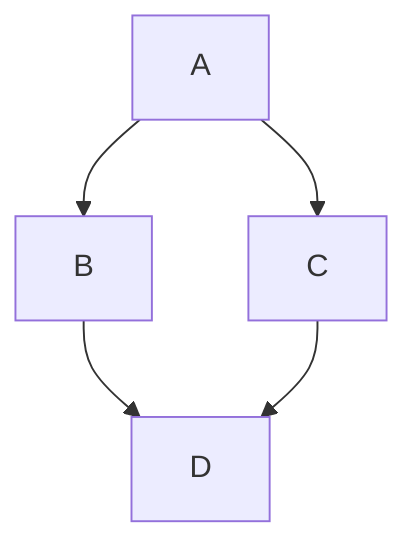
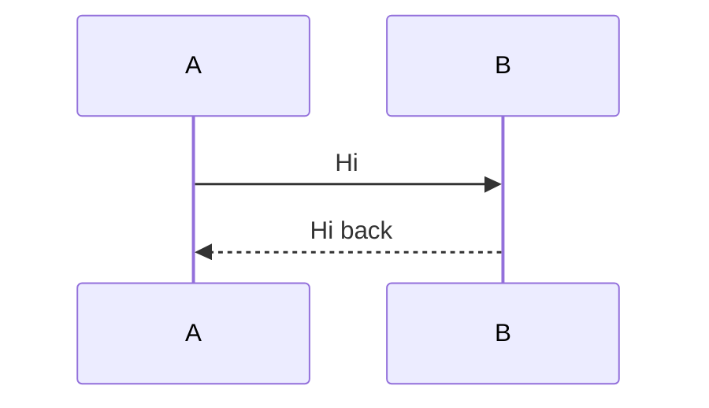
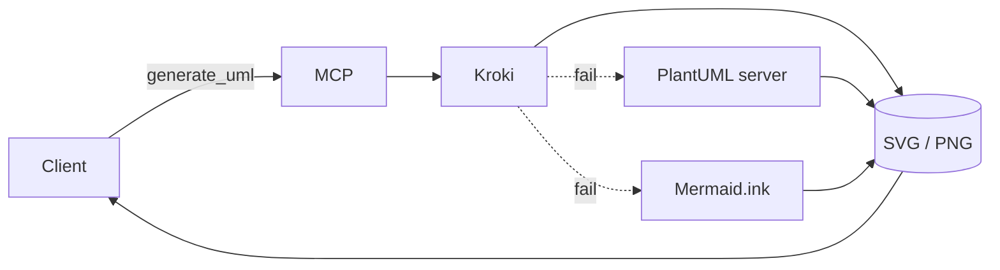

# Getting started

Seven steps take you from a connected MCP client to a rendered diagram in the editor. Each step includes JSON-RPC examples for Cursor, Claude Desktop, a custom HTTP client, or `curl`.

## 1. Connect a client

UML-MCP speaks the [Model Context Protocol](https://modelcontextprotocol.io/) over **stdio** (local subprocess) or **Streamable HTTP** (e.g. the hosted Vercel endpoint). Pick the path that matches your environment.

=== ":material-cursor-default: Cursor"

    Add this entry to your Cursor MCP config (Settings → MCP, or `mcp.json`):

    ```json
    {
      "mcpServers": {
        "uml-mcp": {
          "url": "https://uml-mcp.vercel.app/mcp"
        }
      }
    }
    ```

    Restart Cursor. See [Cursor integration](../integrations/cursor.md) for the local stdio variant.

=== ":material-robot: Claude Desktop"

    Edit `claude_desktop_config.json` (path varies by OS; see [Claude Desktop integration](../integrations/claude_desktop.md)):

    ```json
    {
      "mcpServers": {
        "uml-mcp": {
          "command": "python",
          "args": ["-u", "server.py"],
          "cwd": "/absolute/path/to/uml-mcp",
          "env": {
            "MCP_OUTPUT_DIR": "output"
          }
        }
      }
    }
    ```

    Restart Claude Desktop after saving.

=== ":material-code-tags: Claude Code"

    Add this repository as a plugin marketplace, then install the **`uml-mcp`** plugin (HTTP MCP to the hosted server plus a diagram skill):

    ```text
    /plugin marketplace add https://github.com/antoinebou12/uml-mcp
    /plugin install uml-mcp@uml-mcp-plugins
    ```

    Use a local path instead of the Git URL if you already cloned the repo. Details: [Claude Code integration](../integrations/claude_code.md).

=== ":material-cloud-outline: Smithery"

    Use the published server entry (no JSON editing):

    ```bash
    npm install -g @smithery/cli@latest
    smithery auth login
    smithery mcp add antoinebou12/uml --client cursor
    ```

    Replace `--client cursor` with `--client claude` or any other supported client.

=== ":material-console: HTTP client"

    Any MCP-compliant HTTP client can POST to `/mcp` with `Accept: application/json, text/event-stream`. Quick smoke test with `curl`:

    ```bash
    curl -sN \
      -H 'Accept: application/json, text/event-stream' \
      -H 'Content-Type: application/json' \
      -d '{"jsonrpc":"2.0","id":1,"method":"tools/list"}' \
      https://uml-mcp.vercel.app/mcp
    ```

    The response includes the four tools: `generate_uml`, `validate_uml`, `list_diagram_types`, `generate_uml_batch`.

!!! note "MCP path"

    The MCP route is **always `/mcp`**, never the domain root. `https://uml-mcp.vercel.app/mcp` works; `https://uml-mcp.vercel.app/` does not.

---

## 2. Generate your first diagram

Once the client is connected, call `generate_uml` with a `diagram_type` and a piece of `code`. The minimal Mermaid example:

```json
{
  "jsonrpc": "2.0",
  "id": 2,
  "method": "tools/call",
  "params": {
    "name": "generate_uml",
    "arguments": {
      "diagram_type": "mermaid",
      "code": "graph TD; A-->B; A-->C; B-->D; C-->D;"
    }
  }
}
```

The server replies with a structured payload like:

```json
{
  "code": "graph TD; A-->B; A-->C; B-->D; C-->D;",
  "url": "https://kroki.io/mermaid/svg/...",
  "playground": "https://mermaid.live/edit#...",
  "content_base64": "PHN2ZyB4bWxucz0...",
  "source": "kroki"
}
```

Open `url` for an SVG, `playground` to tweak the source online, or decode `content_base64` for an inline embed. Same diagram rendered live:



!!! tip "Natural-language shortcut"

    In Cursor or Claude Desktop, just say: *"Render a Mermaid flowchart of A → B and A → C, both joining at D."* The assistant calls `generate_uml` with the right payload.

---

## 3. URL/base64 vs save to disk

`generate_uml` has two modes:

- **URL/base64 only:** omit `output_dir`. You get `url`, `playground`, and `content_base64`. No file I/O. Required for serverless deployments (`MCP_READ_ONLY=true` rejects `output_dir`).
- **Save to disk:** pass `output_dir`. You get the same fields plus `local_path`. The server creates the directory if it doesn't exist.

```json
{
  "name": "generate_uml",
  "arguments": {
    "diagram_type": "class",
    "code": "@startuml\nclass User\n@enduml",
    "output_dir": "./output"
  }
}
```

| Mode | When to use | Returned fields |
| --- | --- | --- |
| URL/base64 | Hosted endpoints (Vercel), CI, ephemeral previews | `url`, `playground`, `content_base64` |
| `output_dir` | Local IDE work, embedding into a docs build | + `local_path` |

!!! warning "Vercel runtime"

    The hosted Vercel endpoint runs read-only. Passing `output_dir` returns an error; use the URL/base64 fields instead.

---

## 4. Validate before render

`validate_uml` runs a local check (no Kroki call) so you catch unsupported types or formats before paying for a network round-trip. With `strict: true` it adds extra Mermaid/D2 lints.

```json
{
  "name": "validate_uml",
  "arguments": {
    "diagram_type": "mermaid",
    "code": "graph TD; A-->B;",
    "output_format": "svg",
    "strict": true
  }
}
```

A typical response:

```json
{
  "valid": true,
  "errors": [],
  "suggestions": [],
  "backend": "mermaid",
  "diagram_type": "mermaid",
  "prepared_code": "graph TD; A-->B;",
  "strict": true
}
```

Use `validate_uml` on user-supplied snippets before `generate_uml` so a Kroki HTTP 400 becomes a clear validation error instead of an opaque failure.

---

## 5. Render multiple diagrams in one call

`generate_uml_batch` accepts up to `MCP_BATCH_MAX_ITEMS` (default 20) items in a single tool call. A failure in one item does not stop the batch: each result has its own `index` and either the rendered fields or an `error`.

```json
{
  "name": "generate_uml_batch",
  "arguments": {
    "items": [
      { "diagram_type": "mermaid", "code": "graph LR; A-->B" },
      { "diagram_type": "class",   "code": "@startuml\nclass A\n@enduml" },
      { "diagram_type": "d2",      "code": "x -> y" }
    ],
    "output_dir": null
  }
}
```

Returns:

```json
{
  "results": [
    { "index": 0, "url": "...", "source": "kroki" },
    { "index": 1, "url": "...", "source": "kroki" },
    { "index": 2, "url": "...", "source": "kroki" }
  ]
}
```

!!! note "Batch caps"

    Tune `MCP_BATCH_MAX_ITEMS` via environment variable. Items beyond the cap return a single top-level `error` and an empty `results` array. See [Configuration](../configuration.md).

---

## 6. Customize output: format, theme, scale

Three parameters tune the rendered image:

| Parameter | Effect | Notes |
| --- | --- | --- |
| `output_format` | `svg`, `png`, `pdf`, `jpeg`, `txt`, `base64` | Allowed values depend on `diagram_type`; check `uml://formats`. |
| `theme` | PlantUML `!theme` | Only meaningful for PlantUML-family types (class, sequence, …). |
| `scale` | Float multiplier | SVG only. Default `1.0`, minimum `0.1`. Ignored on Vercel `URL_ONLY` mode. |

```json
{
  "name": "generate_uml",
  "arguments": {
    "diagram_type": "sequence",
    "code": "@startuml\n!theme cerulean\nA -> B: Hi\n@enduml",
    "output_format": "png",
    "theme": "cerulean",
    "scale": 1.5
  }
}
```



---

## 7. Understand the fallback chain

Rendering goes Kroki-first. If Kroki is unreachable or returns an error, the pipeline can fall back to:

1. A **PlantUML server** (controlled by `PLANTUML_SERVER` / `USE_LOCAL_PLANTUML`) for PlantUML-family diagrams.
2. **Mermaid.ink** for `diagram_type: mermaid`.

The successful response includes a `source` field telling you which backend produced the image:



Possible values: `"kroki"`, `"plantuml_server"`, `"mermaid_ink"`. See [Fallback strategy](../fallback-mechanism.md) and [Configuration](../configuration.md) for the env knobs that control it.

---

## Next steps

<div class="grid cards" markdown>

-   :material-book-open-variant: **API reference**

    ---

    All four MCP tools, the `uml://` resources, and registered prompts.

    [:octicons-arrow-right-24: Open the reference](../reference/index.md)

-   :material-puzzle-outline: **Diagram Assistant**

    ---

    Mermaid sequence/Gantt, BPMN, class-to-Mermaid conversion via named prompts.

    [:octicons-arrow-right-24: Diagram Assistant](../diagram-assistant.md)

-   :material-cloud-cog: **Deploy your own**

    ---

    Vercel + Smithery, Docker, or local stdio with optional local Kroki.

    [:octicons-arrow-right-24: Deploy guide](../deploy/index.md)

-   :material-language-python: **Python API**

    ---

    Auto-generated reference for `mcp_core` and `tools.kroki` modules.

    [:octicons-arrow-right-24: Python API](../reference/python/index.md)

</div>
