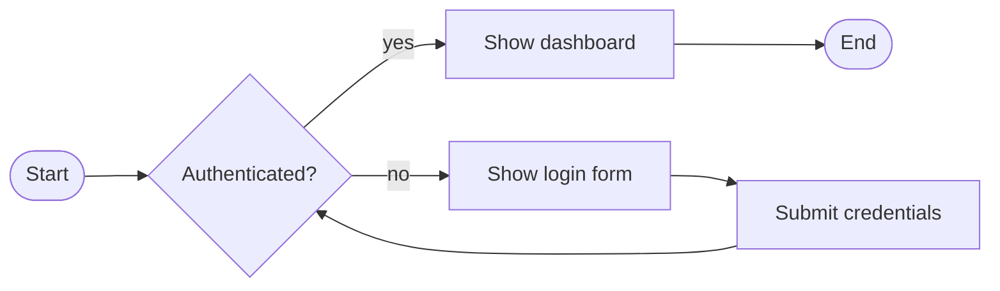
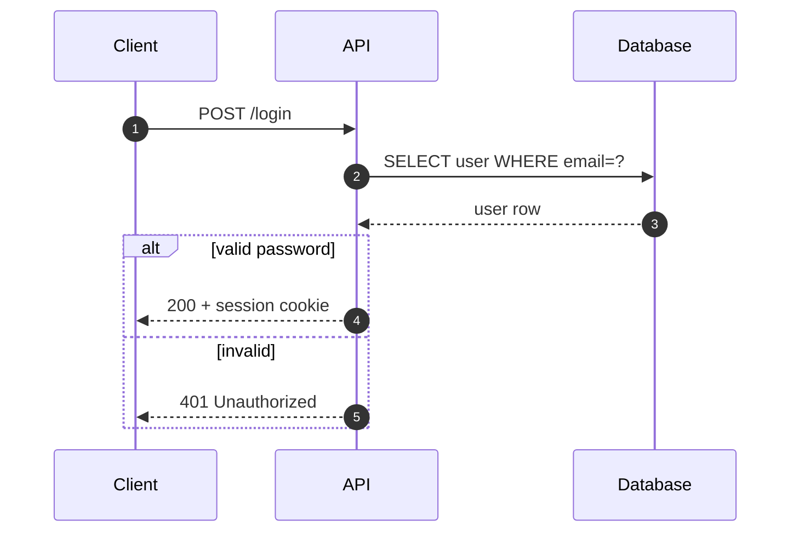
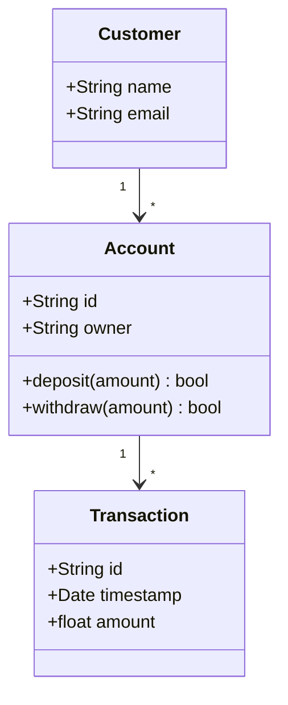
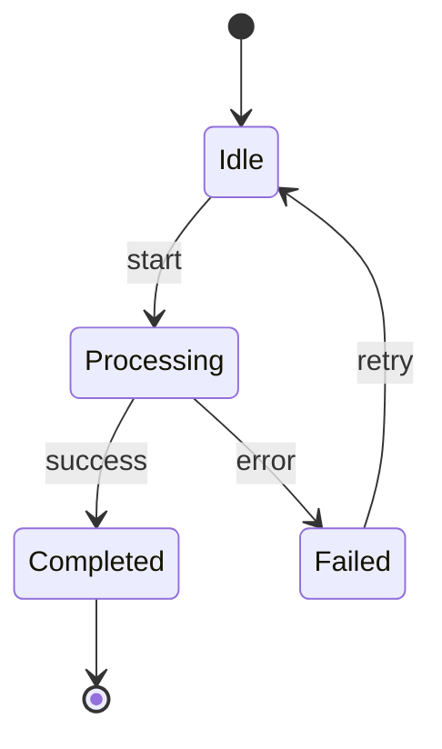
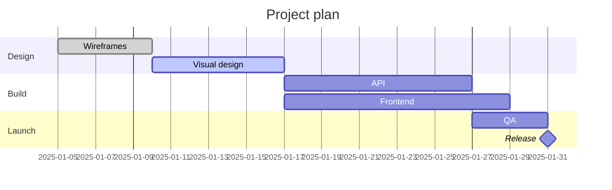
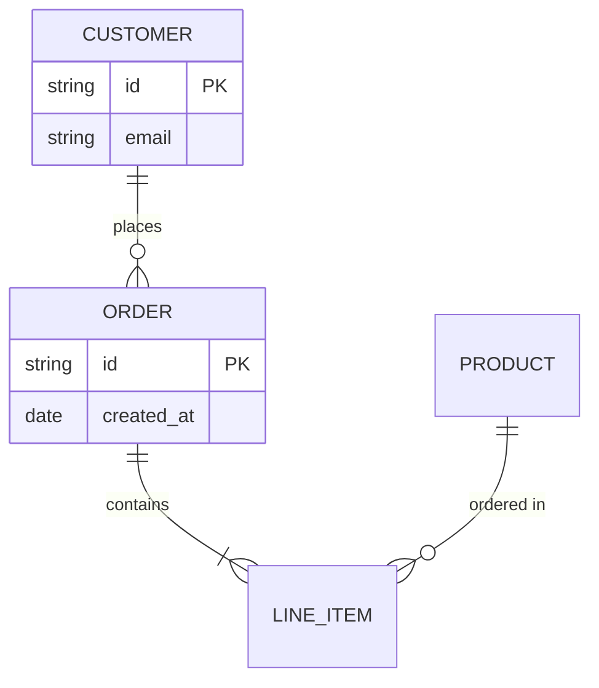
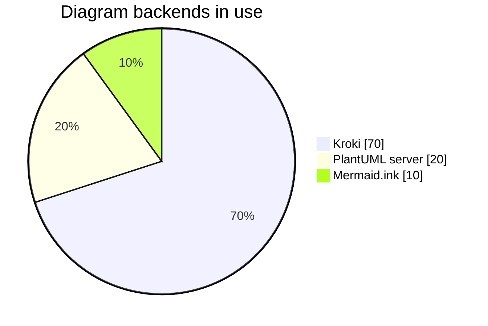

# Mermaid live examples

Every code block on this page is a live Mermaid diagram rendered in your browser. Copy the source and pass it to `generate_uml` with `diagram_type: "mermaid"` to get a server-rendered SVG/PNG (and a Kroki URL you can share).

!!! tip "Quick call"

    ```json
    {
      "name": "generate_uml",
      "arguments": { "diagram_type": "mermaid", "code": "<paste source here>" }
    }
    ```

## Prompts, Sequential Thinking, and server-rendered SVG

Use **natural-language prompts** first, then have the model produce Mermaid source and call **`generate_uml`** with **`"output_format": "svg"`** when you need a static asset, PDF pipeline, or shareable Kroki URL (unlike the in-page diagrams below, which rely on JavaScript).

**Optional Sequential Thinking MCP.** In clients such as Cursor you can enable a **Sequential Thinking** server alongside UML-MCP. It is a separate product: use its `sequentialthinking` tool to step through scope, diagram type, participants, edge cases, then finish with **`nextThoughtNeeded: false`** before invoking `generate_uml`. UML-MCP’s own **`uml_diagram_with_thinking`** prompt is different: it is fetched with `prompts/get` and only affects how the model plans inside the chat.

**Named prompts on UML-MCP** (see [MCP prompts](../reference/prompts.md)):

| Prompt | Use when |
| --- | --- |
| `mermaid_sequence_api` | HTTP-style `sequenceDiagram` with client, API, optional DB, `alt` / errors. |
| `mermaid_gantt` | `gantt` with sections, `dateFormat`, dependencies. |
| `convert_class_to_mermaid` | Turn class structure (PlantUML or prose) into `classDiagram`. |
| `uml_diagram_with_thinking` | Any Mermaid type with an explicit plan-then-code step. |

Example chat prompts:

```
Using the mermaid_sequence_api style, draw a sequenceDiagram for OAuth2 authorization code flow:
browser, auth server, resource API, and token storage. Include success and error alt branches.
```

```
Gantt chart for a two-sprint release: Sprint 1 backend, Sprint 2 frontend and QA, milestone release.
Use the mermaid_gantt conventions from uml-mcp prompts.
```

**Illustrative Sequential Thinking steps** before generating the flowchart in the next section:

1. Diagram type is **flowchart** (`flowchart LR`), not sequence.
2. Decision **Authenticated?** splits login vs dashboard paths.
3. Loop: submit credentials and re-check authentication.
4. Terminal **End** only after success path.
5. Call `validate_uml` then `generate_uml` with `diagram_type: "mermaid"` and `"output_format": "svg"`.

**Direct `tools/call`** for that flowchart (same source as the SVG asset below):

```json
{
  "jsonrpc": "2.0",
  "id": 1,
  "method": "tools/call",
  "params": {
    "name": "generate_uml",
    "arguments": {
      "diagram_type": "mermaid",
      "output_format": "svg",
      "code": "flowchart LR\n    A([Start]) --> B{Authenticated?}\n    B -- yes --> C[Show dashboard]\n    B -- no  --> D[Show login form]\n    D --> E[Submit credentials]\n    E --> B\n    C --> F([End])"
    }
  }
}
```

**Example output** (SVG from UML-MCP `generate_uml` with the same `code` as the live diagram under [Flowchart](#flowchart)):



See also [Diagram Assistant](../diagram-assistant.md) for how prompts map to tools and `uml://` resources.

## Flowchart



## Sequence (API call)

Same shape as the `mermaid_sequence_api` prompt and the `sequence_api` example under `uml://mermaid-examples`.



## Class diagram



## State diagram



## Gantt chart

Same shape as the `mermaid_gantt` prompt.



## Entity-relationship



## Pie chart



---

## Notes

!!! note "Server vs in-page rendering"

    The diagrams above use the **Mermaid runtime in your browser** (via `pymdownx.superfences`). `generate_uml` returns server-rendered SVG/PNG from Kroki, which suits static sites, PDFs, or any consumer that does not run JavaScript.

!!! tip "Validate first"

    Use `validate_uml(diagram_type="mermaid", code=..., strict=true)` to catch issues like missing `graph` directives or invalid sequence arrows before calling `generate_uml`.

See [Diagram Assistant](../diagram-assistant.md) for the matching named prompts (`mermaid_sequence_api`, `mermaid_gantt`, `convert_class_to_mermaid`).
