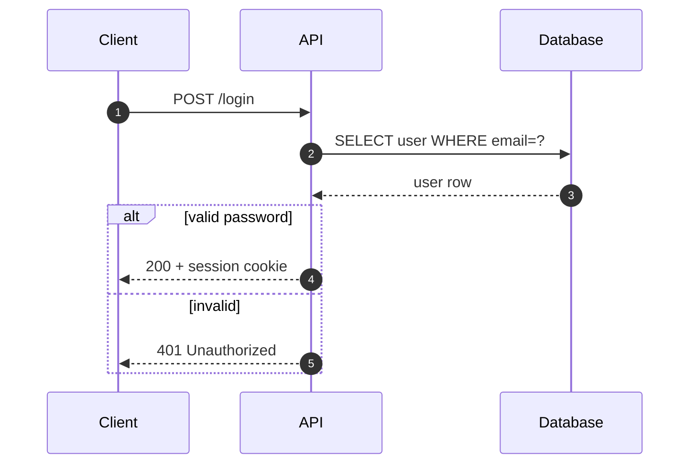
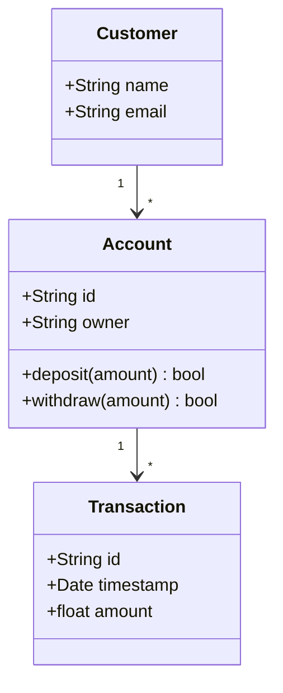
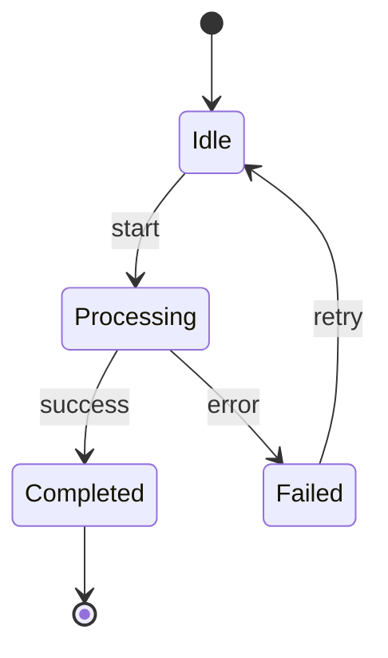
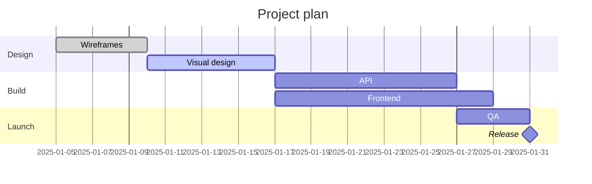
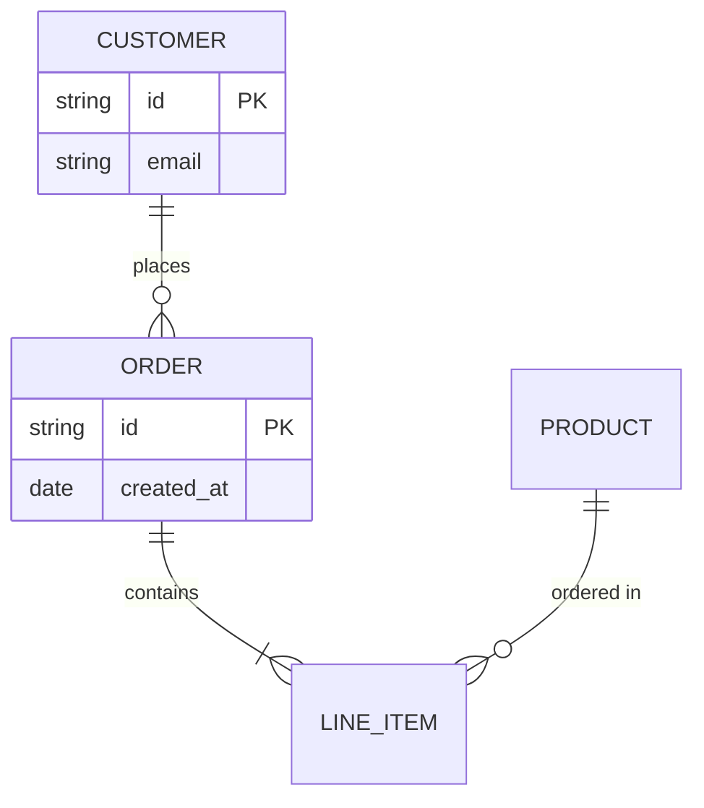
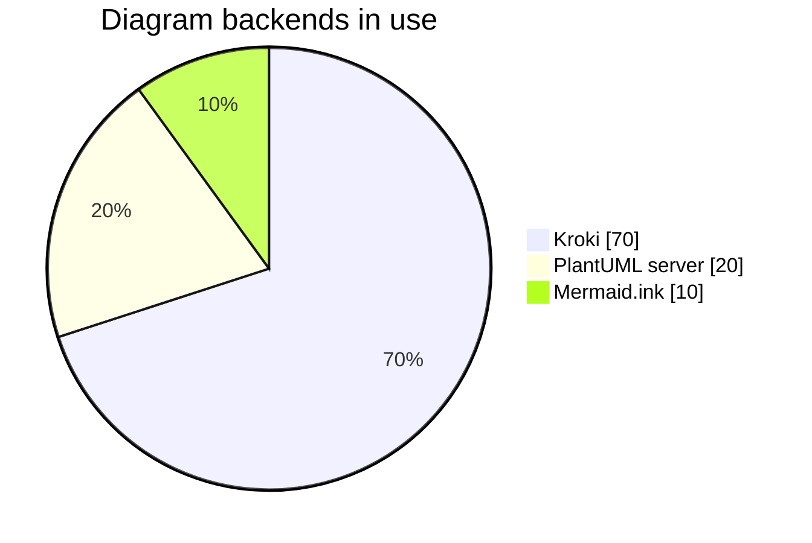

# Mermaid live examples

Every code block on this page is a live Mermaid diagram rendered in your browser. Copy the source and pass it to `generate_uml` with `diagram_type: "mermaid"` to get a server-rendered SVG/PNG (and a Kroki URL you can share).

!!! tip "Quick call"

    ```json
    {
      "name": "generate_uml",
      "arguments": { "diagram_type": "mermaid", "code": "<paste source here>" }
    }
    ```

## Flowchart


## Sequence (API call)

Same shape as the `mermaid_sequence_api` prompt and the `sequence_api` example under `uml://mermaid-examples`.



## Class diagram



## State diagram



## Gantt chart

Same shape as the `mermaid_gantt` prompt.



## Entity-relationship



## Pie chart



---

## Notes

!!! note "Server vs in-page rendering"

    The diagrams above use the **Mermaid runtime in your browser** (via `pymdownx.superfences`). `generate_uml` returns server-rendered SVG/PNG from Kroki, which suits static sites, PDFs, or any consumer that does not run JavaScript.

!!! tip "Validate first"

    Use `validate_uml(diagram_type="mermaid", code=..., strict=true)` to catch issues like missing `graph` directives or invalid sequence arrows before calling `generate_uml`.

See [Diagram Assistant](../diagram-assistant.md) for the matching named prompts (`mermaid_sequence_api`, `mermaid_gantt`, `convert_class_to_mermaid`).
