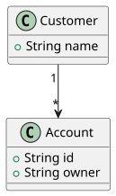

# PlantUML prompts and SVG

Use this track when you want **UML-style** diagrams (classes, sequences, activities, use cases) rendered by **PlantUML** through Kroki. For syntax details and more examples, see [UML (PlantUML)](../diagrams/uml.md).

## Prerequisites

- A connected **UML-MCP** server ([Getting started](getting-started.md)).
- Optional: a **Sequential Thinking** MCP server in the same client (for example Cursor) if you want explicit multi-step reasoning *before* calling `generate_uml`. It is **not** part of UML-MCP; it complements `uml_diagram_with_thinking`, which is a **named prompt** on UML-MCP only.

## Natural-language prompts (copy-paste)

Ask your assistant in plain language, then let it fetch `uml://types` / `uml://workflow` and call tools:

```
Draw a PlantUML class diagram for a small library: Book, Copy, Member, Loan.
Book has title and isbn. Member has id and name. Loan links a Member to a Copy with dueDate.
A Book has many Copies. A Member can have many active Loans.
```

```
Produce a PlantUML sequence diagram: Client calls POST /orders, API validates payload,
writes to Orders DB, publishes OrderCreated to a message queue, returns 201 with order id.
Include alt: validation failure returns 400.
```

```
Activity diagram (PlantUML): start, read config file, if valid parse else show error,
if parse ok run pipeline then end; on pipeline error log and end.
```

```
Use case diagram: Actor Librarian manages catalog; Actor Member searches and borrows;
system boundary LibrarySystem; include relationship SearchCatalog from Borrow to Search.
```

## Example Sequential Thinking flow (then `generate_uml`)

Illustrative steps you might run through the **Sequential Thinking** tool before generating:

1. **Scope:** Static structure only (classes + associations), no sequence.
2. **Notation:** PlantUML `class` with `@startuml` / `@enduml`, visibility optional.
3. **Entities:** Account, Customer, one-to-many Customer to Account.
4. **Risks:** Avoid ambiguous navigability; name associations clearly.
5. **Validation:** Call `validate_uml` with `diagram_type: class` and the same source, then `generate_uml` with `"output_format": "svg"`.

Then call **`generate_uml`** with `diagram_type` set to a PlantUML-backed type (for example `class`, `sequence`, or raw `plantuml`), your final source as `code`, **`"output_format": "svg"`**, and omit `output_dir` (or set it to `null`) if you only need a URL or `content_base64` without writing a file.

## Named MCP prompts (UML-MCP)

| Prompt | Use when |
| --- | --- |
| `uml_diagram` | Generic plan-then-generate for any supported type. |
| `uml_diagram_with_thinking` | Same, with an explicit planning step before code. |
| `class_diagram` | Class diagram from prose. |
| `sequence_diagram` | Sequence diagram from prose. |
| `activity_diagram` | Activity / workflow from prose. |
| `usecase_diagram` | Use case diagram from prose. |

Fetch text with `prompts/get` (see [MCP prompts](../reference/prompts.md)).

## Direct `tools/call` (JSON-RPC)

Minimal example for the diagram below (same source as the committed SVG):

```json
{
  "jsonrpc": "2.0",
  "id": 1,
  "method": "tools/call",
  "params": {
    "name": "generate_uml",
    "arguments": {
      "diagram_type": "class",
      "output_format": "svg",
      "code": "@startuml\nclass Account {\n  +String id\n  +String owner\n}\nclass Customer {\n  +String name\n}\nCustomer \"1\" --> \"*\" Account\n@enduml"
    }
  }
}
```

## Example output (server-rendered SVG)

This asset was produced with UML-MCP `generate_uml` (`diagram_type: class`, `output_format: svg`) and the same `code` as above.


